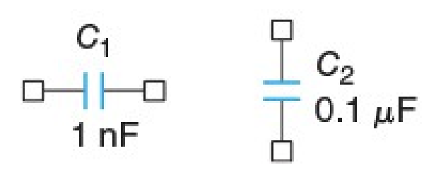
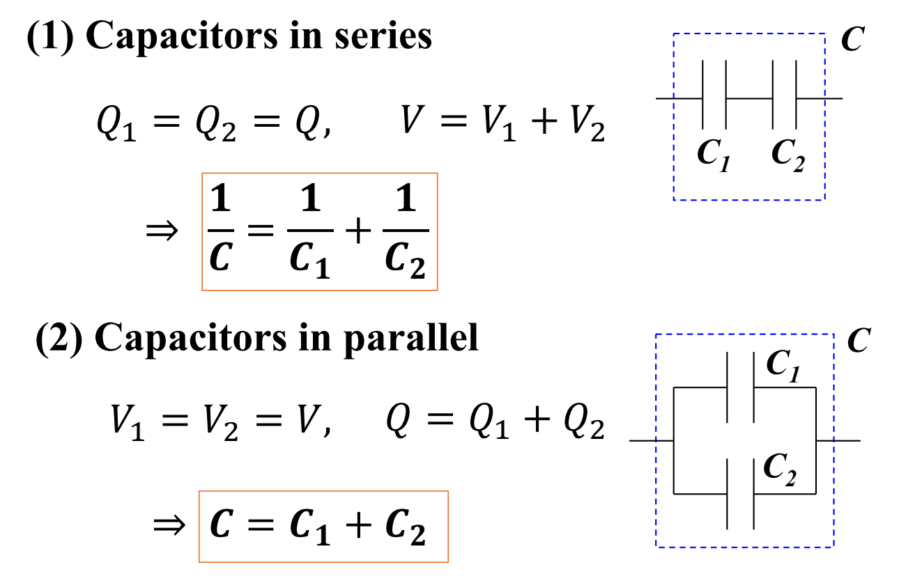

# Lecture 10 : Capacitors

## Capacitors（电容器）

### 电容器的定义

电容器(Capacitor)是一种用来存储电荷的元件，它由两个导体之间的绝缘介质组成。电容器的电容量是指电容器存储电荷的能力，通常用 $C$ 表示，单位是法拉(F)。

在电路图中，电容的表示方法如图所示

一个平行板电容器有两个平行的金属板，两个金属板之间的空间被填充了绝缘介质。当电容器接入电路中时，电容器会存储电荷，电容器的电容量取决于电容器的几何形状和介质的性质。

电容的容值(Capacitance)是指电容器存储电荷的能力，通常用 $C$ 表示，单位是法拉(F)。电容的容值与电容器的几何形状和介质的性质有关，电容的容值可以通过以下公式计算：

$$
C = \frac{Q}{\Delta V}
$$

在这里， $Q$ 是电容器上的电荷， $\Delta V$ 是电容器上的电压。这个式子说明了电容的容值是电容器上的电荷和电压的比值。而这个比值是一个常数，称为电容的容值。

根据大物课上的知识，对于一个电容器，他的容值的决定式应该是这样的

$$
C = \frac{\varepsilon A}{d}
$$

其中， $\varepsilon$ 是介电常数， $A$ 是电容器的面积， $d$ 是电容器的间距。

### 电容器的UI关系

如果电压在电容器上发生变化，电容器上的电荷也会发生变化。电容器上的电荷和电压之间的关系可以用以下公式表示：

$$
Q = C \cdot v(t)
$$

把这个式子两边求导，就能得到电容器上的电流：

$$
i(t) = C \cdot \frac{dv(t)}{dt} \\
\int_{-\infin}^t i\cdot dt = C \cdot v(t)
$$

通过电容器的电流决定了电容器的充电速度，电容器的电流是电压的导数。

根据这个结果，可以发现，如果给电容施加一个标准的正弦信号时 ( 这里假定 $v(t)=A\cos(\omega t)$ )

$$
i(t) = C\cdot\frac{dv(t)}{dt} = -CA\omega\sin(\omega t) = CA\omega\cos(\omega t + \frac{\pi}{2})
$$

由此可见，电容器的电流和电压之间的相位差是 $\frac{\pi}{2}$ ，并且电流的相位比电压的相位要领先。

两者的幅值之比是 $\frac{1}{C\omega}$ 。这说明电容器的阻抗与通过其的电流频率成正比，即 $Z_C = \frac{1}{j\omega C}$ 。

同理，可以推得如果电容器两端的电压时恒定值（即DC）时，电容器上的电流是0。·

$$
i(t) = C\cdot\frac{dv(t)}{dt} = 0
$$

总的来说，电容器在直流时相当于开路，而在极高频时相当于短路。

## Series and Parallel Connection of Capacitors（电容器的串联和并联）

> 此事在Physics II中已经学过，这里就不再赘述了。

电容器串联，则同一时间通过他们的电流是一样的，每个电容器最终充电的电荷量是一致的，因此

$$
Q_1 = Q_2 = \dots = Q_n
$$

$$
V = V_1 + V_2 + \dots + V_n
$$

$$
\frac{1}{C'} = \frac{V}{Q_1} = \frac{V_1+V_2+\dots+V_n}{Q} = \frac{1}{C_1} + \frac{1}{C_2} + \dots + \frac{1}{C_n}
$$

等效的电容量的倒数等于各个电容器的电容量倒数之和。

电容器并联，各个电容器两端电压相等，因此

$$
V = V_1 = V_2 = \dots = V_n
$$

$$
Q = Q_1 + Q_2 + \dots + Q_n
$$

$$
C' = \frac{Q}{V} = C_1 + C_2 + \dots + C_n
$$

等效的电容量等于各个电容器的电容量之和。