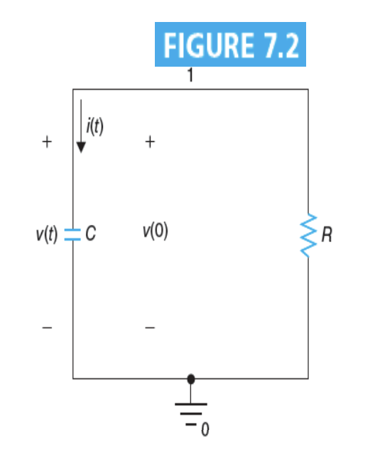
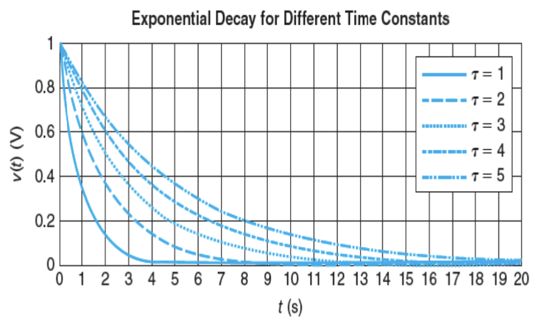
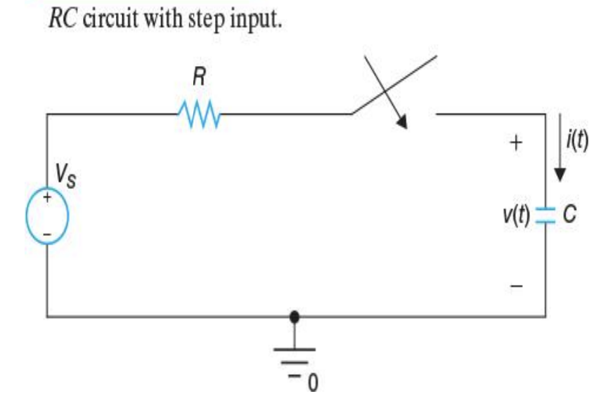
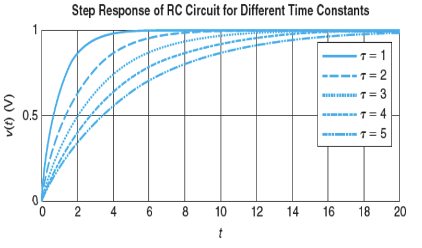
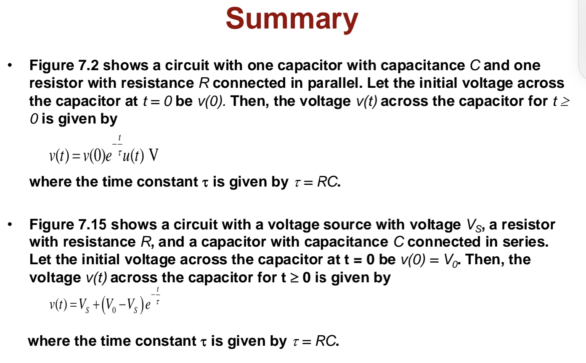

# Lecture 12 : RC Circuit

> 这课上的真是同时折磨所有人
>
> 能同时折磨听课的，不听课的和老师的课程安排，能做出来也是一种奇迹。

## Natural Response of RC Circuit（RC电路的自然响应）

### RC电路的UI关系

自然响应（Natural Response）是指在电路中没有外加电源的情况下，电路中的电压和电流的变化情况。对于一个RC电路，它的自然响应是指在电容器上的电压和电流的变化情况。即使没有外部信号输入，其内部的信号也会发生变化。

对于一个标准的RC电路，可以通过KCL和KVL来得到这样的微分方程：

$$
C\frac{dv(t)}{dt} + \frac{v(t)}{R} = 0
$$

把这个方程化简可得

$$
\frac{dv(t)}{dt} = -\frac{1}{RC}v(t)
$$

$$
\frac{d\ln v(t)}{dt} = -\frac{1}{RC}
$$

$$
\ln v(t) = -\int\frac{dt}{RC} = -\frac{t}{RC} + C
$$

$$
v(t) = e^{\ln v(t)} = e^{-\frac{t}{RC} + C} = e^{-\frac{t}{RC}}\cdot e^C = A\cdot e^{-\frac{t}{RC}}
$$

由此，我们得出了RC电路的自然响应的表达式 $v(t)=A\cdot e^{-\frac{t}{RC}}$ 。其中，$A$ 是一个常数，它由初始条件决定。

当 $t=0$ 时， $v(0) = A\cdot e^0 = A$ ，即为电容器上的电压。

而电路中的电流 $i(t)$ 也可以通过电压和电阻的关系得到：

$$
i(t) = \frac{v(t)}{R} = \frac{A\cdot e^{-\frac{t}{RC}}}{R}
$$

或者

$$
i(t) = -C\cdot\frac{dv(t)}{dt} = -C\cdot (-\frac{1}{RC})\cdot A\cdot e^{-\frac{t}{RC}} = \frac{A}{R}\cdot e^{-\frac{t}{RC}}
$$

电容上释放的功率是：

$$
p_C(t) = v(t)\cdot i(t) = A\cdot e^{-\frac{t}{RC}}\cdot \frac{A}{R}\cdot e^{-\frac{t}{RC}} = \frac{A^2}{R}\cdot e^{-\frac{2t}{RC}}
$$

这也同时是电阻上消耗的功率。

所以：

$$
w_R(t) = \int_0^t p_R(\tau)d\tau = \int_0^t \frac{A^2}{R}\cdot e^{-\frac{2\tau}{RC}}d\tau = \frac{A^2}{R}\cdot \int_0^t e^{-\frac{2\tau}{RC}}d\tau \\
= \frac{A^2}{R}\cdot \left[ -\frac{RC}{2}e^{-\frac{2\tau}{RC}} \right]_0^t = \frac{CA^2}{2}\cdot (1 - e^{-\frac{2t}{RC}})
$$

当 $t\rightarrow\infin$ 时，$w_R(t)\rightarrow\frac{CA^2}{2}$ ，即电容器上的能量全部转化为电阻上的热能。

> 这里推导的所有表达式都是针对于 $t>0$ 的情况。
>
> 有的时候，表达式会写成针对 $t\isin R$的情况，这时候会乘一个 $u(t)$ 。这个函数的定义是在 $t\geq 0$ 时为1，在 $t<0$ 时为0。

> 另一点需要注意的是，RC电路的R和C可以是整个电路中等效的R和C，而并不一定是分立的电阻和电容元件。

### RC电路的时间常数

在RC电路中，有一个重要的参数叫做时间常数（Time Constant），记作 $\tau$ 。它的定义是：

$$
\tau = RC
$$

因此，$v(t), i(t), p_C(t)$的表达式可以写成：

$$
v(t) = V_0\cdot e^{-\frac{t}{\tau}}\\
$$

$$
i(t) = \frac{V_0}{R}\cdot e^{-\frac{t}{\tau}}\\
$$

$$
p_C(t) = \frac{V_0^2}{R}\cdot e^{-\frac{2t}{\tau}}
$$

时间常数 $\tau$ 是一个描述电路响应速度的参数。它的值越大，电路的响应速度越慢。

它的物理意义是：当 $t=\tau$ 时，电容器上的电压下降到原来的 $1/e$ 。将这个时间常数代入电压的表达式中，可以得到：

$$
v(\tau) = V_0\cdot e^{-1} = \frac{V_0}{e}
$$

> 对于需要进行电路等效的情况，可以通过等效电路的方法来得到RC电路的时间常数，即 $\tau = R_{eq}C_{eq}$ 。

## Step Response of RC Circuit（RC电路的阶跃响应）

阶跃响应（Step Response）是指在电路中有一个阶跃信号输入的情况下，电路中的电压和电流的变化情况。对于一个RC电路，它的阶跃响应是指在电容器上的电压和电流的变化情况。

将顺时针看作压降的正方向，根据KVL，可以写出网孔方程：

$$
-V_s + i(t)\cdot R + v(t) = 0\\
i(t)=C\frac{dv(t)}{dt}
$$

进而可得

$$
-V_s+RC\frac{dv(t)}{dt}+v(t)=0
\\ \Rightarrow
\frac{dv(t)}{dt}=\frac{-1}{RC}(v(t)-V_s)
\\ \Rightarrow
\frac{d(ln|v(t)-V_s|)}{dt}=\frac{-1}{RC}
\\ \Rightarrow
ln|v(t)-V_s|=-\frac{t}{RC}+K
\\ \Rightarrow
|v(t)-V_s|=e^{-\frac{t}{RC}+K} = e^{-\frac{t}{RC}}\cdot e^K
\\ \Rightarrow
v(t)-V_s = \pm e^K\cdot e^{-\frac{t}{RC}}
\\ \Rightarrow
v(t) = V_s + Ae^{-\frac{t}{RC}}, A=V_0-V_s
$$

综上，我们得到了RC电路的阶跃响应的表达式 $v(t)=V_s + (V_0-V_s)\cdot e^{-\frac{t}{RC}}$ 。其中，$V_s$ 是阶跃信号的幅值，$V_0$ 是电容器上的电压。

同样的，时间常数 $\tau=RC$ 也可以用来描述RC电路的阶跃响应.

$$
v(t) = V_s + (V_0-V_s)\cdot e^{-\frac{t}{\tau}}
$$

从图中可以看出，时间常数 $\tau$越大，则电路的响应速度越慢。在 $t=\tau$ 时，电压变化量的大小是 $\frac{V_0-V_s}{e}$ 。

可以看出，当 $t\rightarrow\infin$ 时，$v(t)\rightarrow V_s$ ，即电容器上的电压最终会达到阶跃信号的大小。

同样的，可以求得电路中的电流 $i(t)$ 和电容器上释放的功率 $p_C(t)$ ：

$$
i(t) = \frac{v(t)}{R} = \frac{V_s + (V_0-V_s)\cdot e^{-\frac{t}{\tau}}}{R}
$$

$$
p_C(t) = v(t)\cdot i(t) = (V_s + (V_0-V_s)\cdot e^{-\frac{t}{\tau}})\cdot \frac{V_s + (V_0-V_s)\cdot e^{-\frac{t}{\tau}}}{R} 
\\= \frac{(V_s+(V_0+V_s)\cdot e^{-\frac{t}{\tau}})^2}{R}
$$

---

