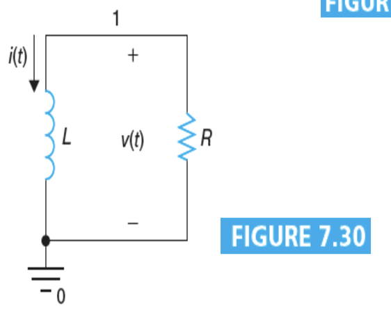
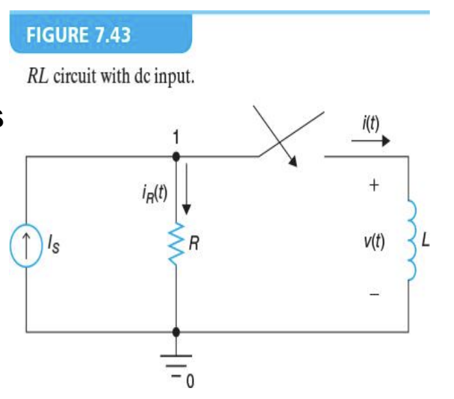
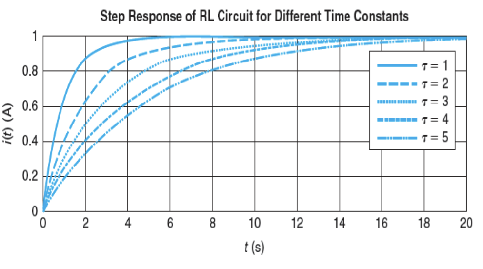
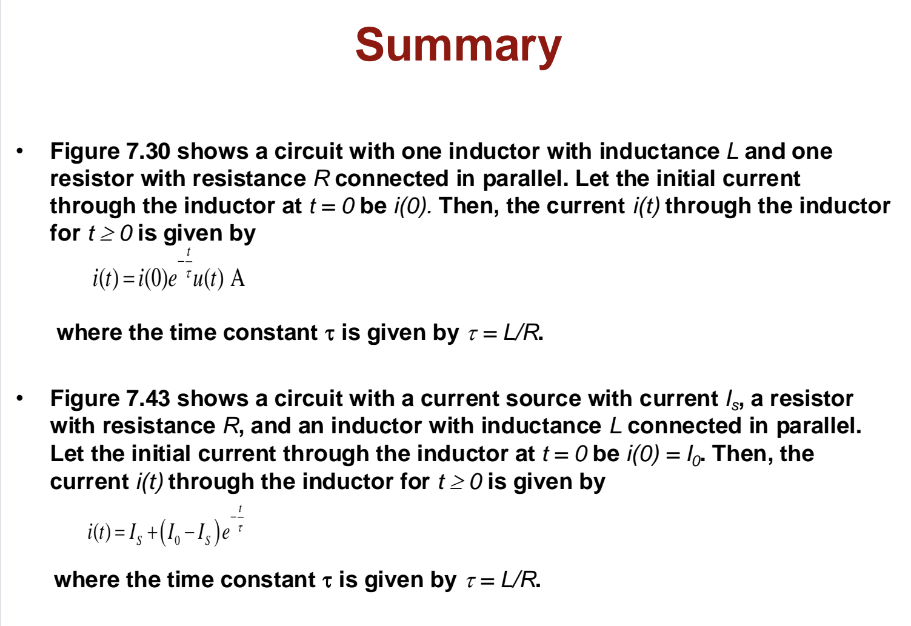

# Lecture 13 : RL Circuit

> 看到了老师手写的教案非常感动
>
> 但是到场人数不到20人
>
> 难绷

## Natural Response of RL Circuit（RL电路的自然响应）

### RL电路的UI关系

当电容或电感具有初始能量时，即使没有外部信号输入，电路中的电压和电流也会发生变化。这种变化称为电路的自然响应。

只有由电路上的初始能量决定的自然响应，称为电路的自然响应。其他的还有瞬态响应(Transient Response)、零输入响应(Zero Input Response)、无源响应(Source-Free Response)等。

对于一个RL电路，我们可以推得：

$$
i(t)+\frac{L}{R}\frac{di(t)}{dt}=0
$$
$$
\Rightarrow \frac{di(t)}{dt} = -\frac{R}{L}i(t)
$$
$$
\Rightarrow \frac{d}{dt}ln(i(t)) = -\frac{R}{L}
$$
$$
\Rightarrow ln(i(t)) = -\int\frac{R}{L}dt = -\frac{R}{L}t + K
$$
$$
\Rightarrow i(t) = e^{ln(i(t))} = e^{-\frac{R}{L}t + K} = e^{-\frac{R}{L}t}\cdot e^K = A\cdot e^{-\frac{R}{L}t}
$$

可以得出，当t在0时，有 $i(0) = A\cdot e^0 = A$ ，即为电感器上的电流。或者可以说 $A=i(0)=I_0$ 。

通过这个来计算电压的大小，可以得到：

$$
v(t)=L\frac{di(t)}{dt} = L\cdot (-\frac{R}{L})\cdot I_0\cdot e^{-\frac{R}{L}t} = -R\cdot I_0\cdot e^{-\frac{R}{L}t}
$$

功率则是：

$$
p(t) = v(t)\cdot i(t) = -R\cdot I_0\cdot e^{-\frac{R}{L}t}\cdot I_0\cdot e^{-\frac{R}{L}t} = -R\cdot I_0^2\cdot e^{-\frac{2R}{L}t}
$$

### RL电路的时间常数

同样的，我们可以定义一个时间常数 $\tau$ 来描述电路的自然响应。 $\tau$ 的大小越大，电路的自然响应越慢。对于一个RL电路，我们把它定义为：

$$
\tau = \frac{L}{R}
$$

在这种情况下，电流、电压、功率的大小可以分别写为：

$$
i(t) = I_0\cdot e^{-\frac{t}{\tau}}
$$
$$
v(t) = -R\cdot I_0\cdot e^{-\frac{t}{\tau}}
$$
$$
p(t) = -R\cdot I_0^2\cdot e^{-\frac{2t}{\tau}}
$$

和RC电路一样，当 $t=\tau$ 时，电感器上的电流下降到原来的 $1/e$ 。把这个时间常数代入电流的表达式中，可以得到：

$$
i(\tau) = I_0\cdot e^{-1} = \frac{I_0}{e}
$$

在 $t=5\tau$ 时，电流下降到原来的 $1/e^5$ 。此时电流的大小为原本的 $1/e^5$ 倍，小于1%的 $I_0$ 。**在大多数情况下，五倍时间常数的时间后的静态相应可以被忽略不计**。

电流的衰减速率在 $t=0$ 时最快，随着时间的增加，电流的衰减速率逐渐减小。在 $t=\infty$ 时，电流的衰减速率为0。

> 还是那个老生常谈的，在计算时间常数是，所需要的电阻值和电感值可能是整个电路等效电阻和等效电感的值。
>
> 也就是说 $\tau = \frac{L_{eq}}{R_{eq}}$ 。

## Step Response of RL Circuit（RL电路的阶跃响应）

### UI关系

电路对直流信号输入（或者说是阶跃信号）的响应称为电路的阶跃响应。对于一个RL电路，它的阶跃响应是指在电感器上的电压和电流的变化情况。当电路中有一个电感器，电路中的电流不会瞬间变化，而是会逐渐变化。

我们可以根据电路图写出这样的节点方程：

$$
-I_s + i(t) + \frac{L}{R}\frac{di(t)}{dt} = 0
$$
$$
\Rightarrow \frac{d}{dt}\ln|i(t)-I_s| = -\frac{R}{L}
$$
$$
|i(t)-I_s| = \pm e^{-\frac{R}{L}t + K} = \pm e^{-\frac{R}{L}t}\cdot e^K = \pm A e^{-\frac{R}{L}t} \  (A=e^K)
$$

于是，电流的响应可以写为：

$$
i(t) = I_s + A e^{-\frac{R}{L}t}
$$

此时 $A=i(0)-I_s$ ，即为电感器上的电流。

同样把 $\tau=\frac{L}{R}$ 作为电路的时间常数，可以得到：

$$
i(t) = I_s + (I_0-I_s)e^{-\frac{t}{\tau}}
$$

同样的，当 $t\rightarrow\infty$ 时，电流的大小趋于 $I_s$ 。这也可以通过其微分方程来解释：

$$
\frac{di(t)}{dt} + \frac{R}{L}i(t) = \frac{R}{L}I_s
$$

当 $t\rightarrow\infty$ 时，电流的变化率为0，即 $\frac{di(t)}{dt}=0$ 。所以电流的大小趋于 $I_s$ 。

### 时间常数

同样的，我们可以定义一个时间常数 $\tau$ 来描述电路的阶跃响应。 $\tau$ 的大小越大，电路的阶跃响应越慢。对于一个RL电路，我们把它定义为：

$$
\tau = \frac{L}{R}
$$

> 超级车轱辘话反复说
>
> 我都不好意思再在之后的RLC电路中再抄一遍这个话了

---

## Summary

> 老师在课上提到Moodle上给的PPT并不好理解，而他手写的PDF阅读资料更好理解一些，所以他建议我们看他手写的资料
>
> 打开一看甚至是扫描全能王扫描的，是真用心了
>
> 课后还问手写的PDF对我们有没有帮助，人确实够好
>
> 唉
