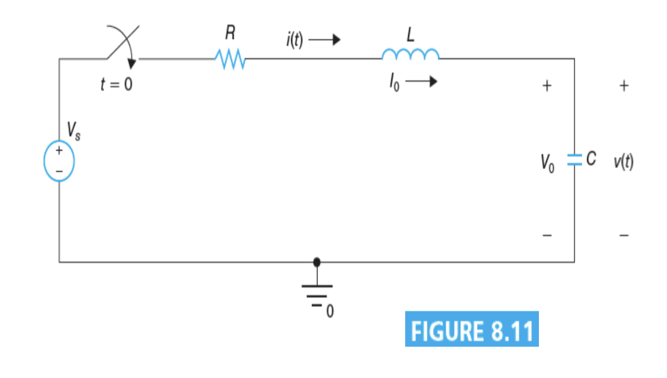
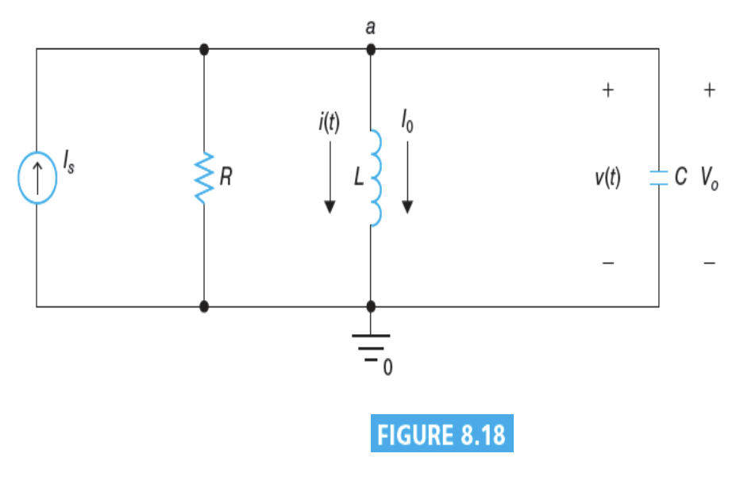
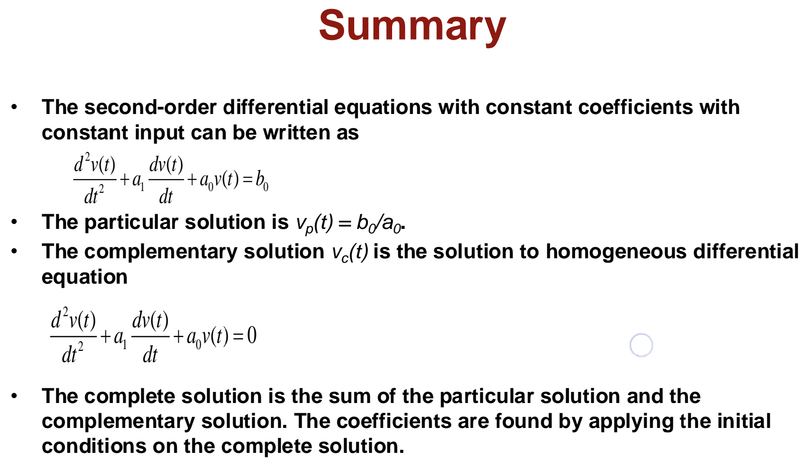
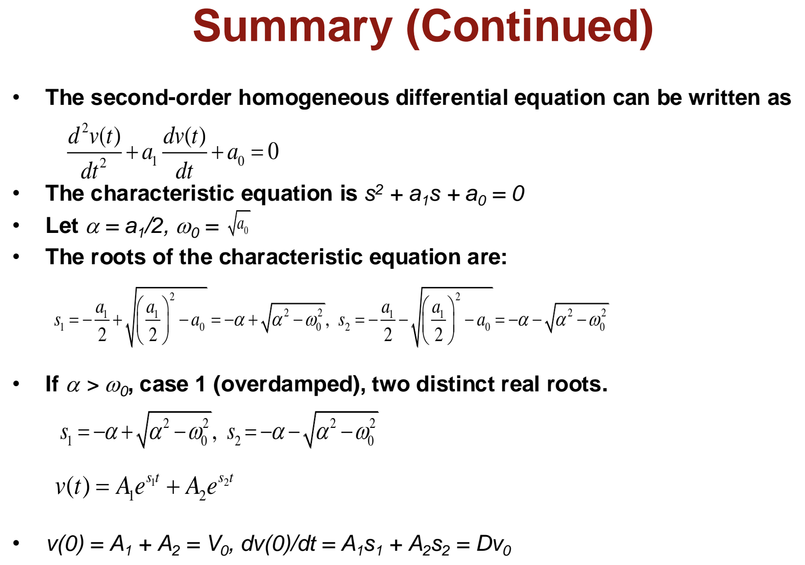
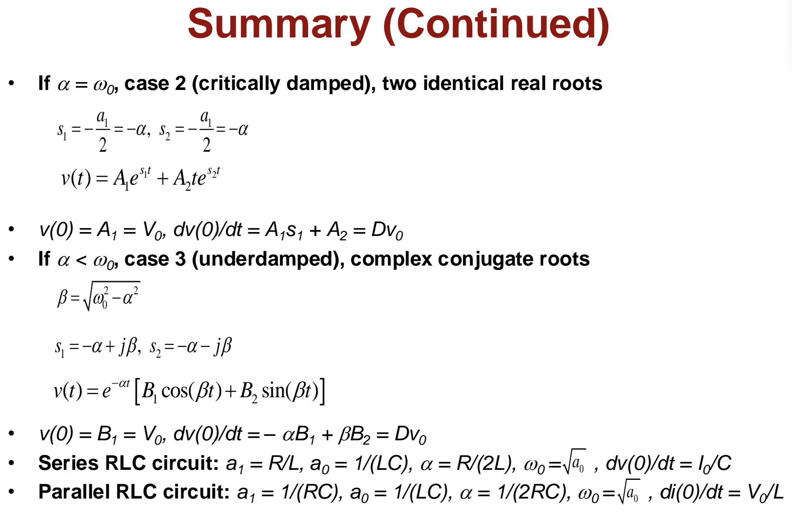

# Lecture 14 : RLC Circuits

> 这节课甚至有两份手写教案，一个叫`RLC Circuit`一个叫`Step Response of RLC Circuit`
>
> 唉

## Solution of the second order differential equation（二阶微分方程的解）

在电路里，我们见到的二阶微分方程的形式是这样的：

$$
\frac{d^2v(t)}{dt^2}+a_1\frac{dv(t)}{dt}+a_0v(t)=f(t)
$$

> 对，我懂，死去的大一上复习了半个月**最后没考**的二阶常微分方程解法突然开始攻击我
>
> 跟详细的讲解请查阅 *Thomas' Calculus @ Chapter 17* 或者 *Physics I* 的**阻尼振动**部分。
>
> 或者一步直达 [布布的高数教室：二阶常系数非齐次线性微分方程](https://www.bilibili.com/video/BV11a411p7Xq)

<!-- 尝试在Markdown里直接插个哔哩哔哩链接（） -->
<!-- <iframe src="//player.bilibili.com/player.html?isOutside=true&aid=215717785&bvid=BV11a411p7Xq&cid=765855186&p=1" scrolling="no" border="0" frameborder="no" framespacing="0" allowfullscreen="true"></iframe> -->

最后得到的解是特定解(particular solution) $v_p(t)$ 和互补解(complementary solution) $v_c(t)$ 的和

互补解指的是这个方程的解：

$$
\frac{d^2v(t)}{dt^2}+a_1\frac{dv(t)}{dt}+a_0v(t)=0
$$

根据大家都很明白的二阶常微分方程的解法，我们可以知道这个方程的解有三种情况：

- **overdamped（过阻尼）**
  - 特征方程有两个实根，且两个实根不相等
  - 最终得到的结果是 $v_c(t)=K_1e^{r_1t}+K_2e^{r_2t}$
  - 此处 $r_1$ 和 $r_2$ 是特征方程的两个实根， $K_1$ 和 $K_2$ 是待定系数，可以通过初始条件来求得
- **underdamped（欠阻尼）**
  - 特征方程有两个共轭复根
  - 最终得到的结果是 $v_c(t)=e^{-\alpha t}(K_1\cos(\omega_d t)+K_2\sin(\omega_d t))$
  - 此处 $\alpha$ 是特征方程的实部， $\omega_d$ 是特征方程的虚部， $K_1$ 和 $K_2$ 是待定系数，可以通过初始条件来求得
- **critically damped（临界阻尼）**
  - 特征方程有两个相等的实根
  - 最终得到的结果是 $v_c(t)=(K_1+K_2t)e^{-\alpha t}$
  - 此处 $\alpha$ 是特征方程的实部， $K_1$ 和 $K_2$ 是待定系数，可以通过初始条件来求得

分别对应着他的特征方程 $x^2+a_1x+a_0=0$ 的实根数量的不同情况。

先根据这个方程求出互补解，再回到原方程来求得特殊解：

当 $f(t)=b_0$ 时，特殊解是一个常数 $v_p(t)=K$ ，这样带入后可以得到

$$
a_0\cdot K=b_0
$$

于是 $v_p(t)=\frac{b_0}{a_0}$ ,最终我们求得的方程的解则为 $v(t)=v_p(t)+v_c(t)$

## Step Response of Series RLC Circuit（串联RLC电路的阶跃响应）

> 我还要再写一遍什么叫阶跃响应吗

在 $t=0$ 时，开关关闭，相当于给电路施加了一个阶跃函数。我们可以根据这个得出这样的方程：

对于压降：

$$
-V_s + R\cdot i(t) + L\frac{di(t)}{dt} + v(t) = 0
$$

对于电容两端电压 $v(t)$ ：

$$
i(t) = C\frac{dv(t)}{dt}
$$

结合起来可以得到：

$$
-V_s + RC\frac{dv(t)}{dt} + v(t) + LC\frac{d^2v(t)}{dt^2} = 0
$$

把这个方程的系数化为标准形式：

$$
\frac{d^2v(t)}{dt^2}+\frac{R}{L}\frac{dv(t)}{dt}+\frac{1}{LC}v(t)=\frac{V_s}{LC}
$$

此时有 $a_0=\frac{1}{LC}$ ， $a_1=\frac{R}{L}$ ， $f(t)=\frac{V_s}{LC}$

根据上面的解法，我们可以得到这个方程的解。可以看出，这个结果和之前在大物课上提到的简谐振动里的阻尼振动的解是一样的，他们也有类似的现象。

## Step Response of Parallel RLC Circuit（并联RLC电路的阶跃响应）

在 $t=0$ 时，开关关闭，相当于给电路施加了一个阶跃函数。我们可以根据这个得出这样的方程：

对于电流：

$$
-I_s + i(t) + \frac{v(t)}{R} + C\frac{dv(t)}{dt} = 0
$$

对于电感两端电压 $v(t)$ ：

$$
v(t) = L\frac{di(t)}{dt}
$$

结合起来可以得到：

$$
-I_s + i(t) + +\frac{L}{R}\frac{di(t)}{dt} + LC\frac{d^2i(t)}{dt^2} = 0
$$

化简到标准形式：

$$
\frac{d^2i(t)}{dt^2}+\frac{1}{RC}\frac{di(t)}{dt}+\frac{1}{LC}i(t)=\frac{I_s}{LC}
$$

此时有 $a_0=\frac{1}{LC}$ ， $a_1=\frac{1}{RC}$ ， $f(t)=\frac{I_s}{LC}$

然后通过之前的解法，我们可以得到这个方程的解。

## General second order circuit（二阶电路的一般形式）

中译中一下，这里的一般形式指的是 $f(t)$ 是一个任意的函数，而不仅仅是阶跃函数，或者说不是常数。

他会出现的情况有：

- 电路不能被化简成串联或并联的RLC电路
- 电路有多个电容器或电感器

下面是PPT里列出的对于不同的输入函数 $f(t)$ 的解法：

Input $f(t)$ | Particular Solution $v_p(t)$
-|-
$A$ | $K$
$Ae^{st}$ | $Ke^{st}$
$A\cos(\omega t)$ | $K_1\cos(\omega t)+K_2\sin(\omega t)$
$A\sin(\omega t)$ | $K_1\cos(\omega t)+K_2\sin(\omega t)$
$A_1\cos(\omega_1 t)+A_2\sin(\omega_2 t)$ | $K_1\cos(\omega_1 t)+K_2\sin(\omega_2 t)$
$A_2t^2+A_1t+A_0$ | $K_2t^2+K_1t+K_0$

> 对，还是在 *Thomas' Calculus* 里讲过

---

## Summary

> 你说得对，但是 ***Ave Mujica*** 是由Bang Dream!自主研发的一款2025年1月新番。故事发生在一个被称作羽丘女子学园的幻想世界，在这里被Sakiko选中的乐队成员将被授予Ave Mujica的假面，开Live赚大钱。你将扮演一位名为三角初华的神秘角色，在乐队生活中中邂逅性格各异、能力独特的同伴们，和他们一起演奏，找寻自己的目标的同时，逐步发掘丰川祥子背后的真相 。
>
> [颂乐人偶：主PV 2025年1月2日起，独家同步播出！](https://www.bilibili.com/bangumi/play/ep1185703)
