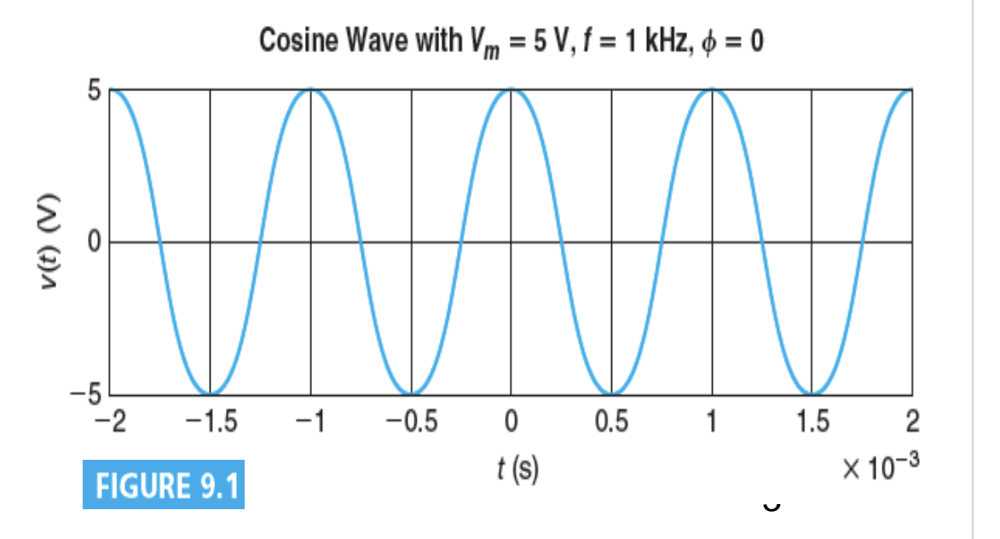
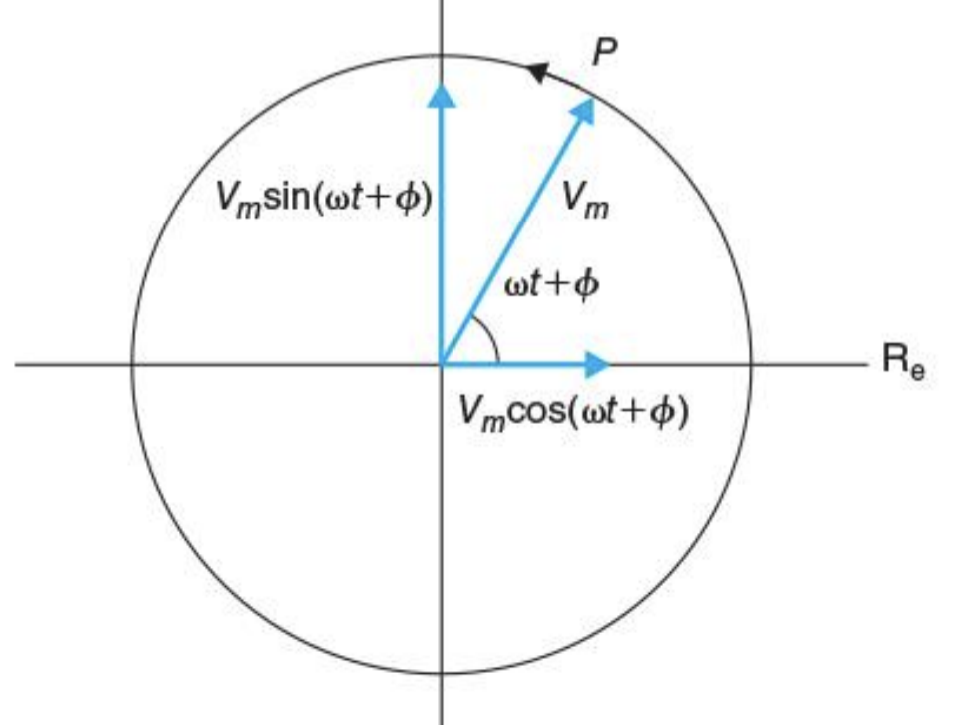
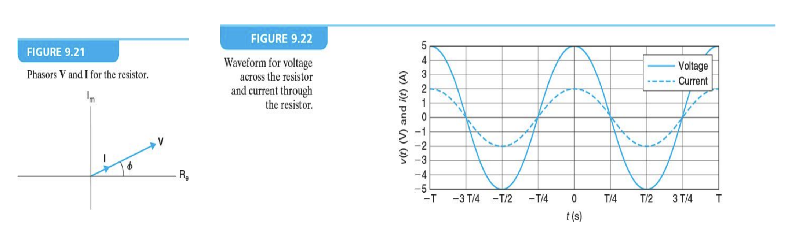
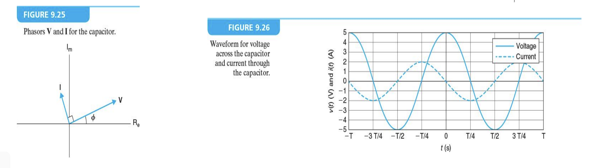
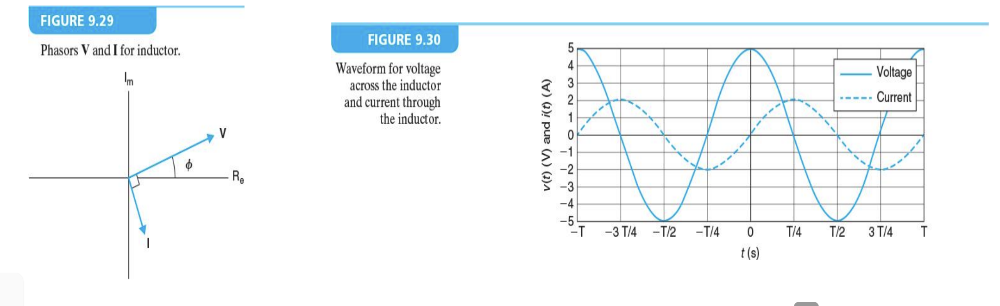
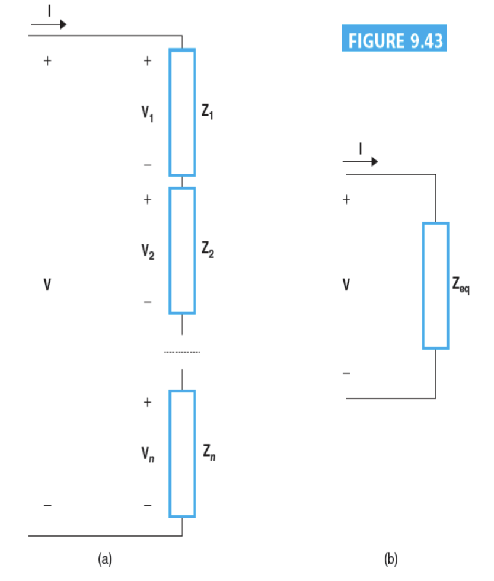
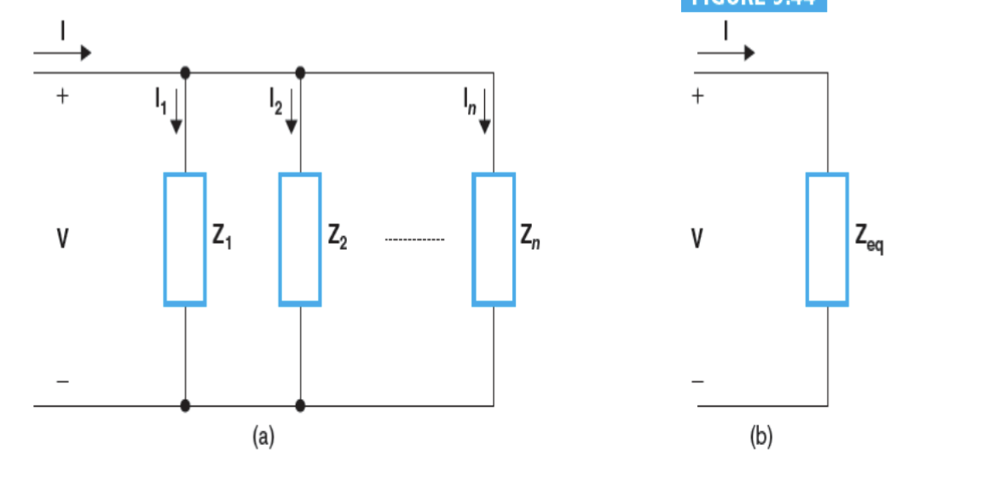
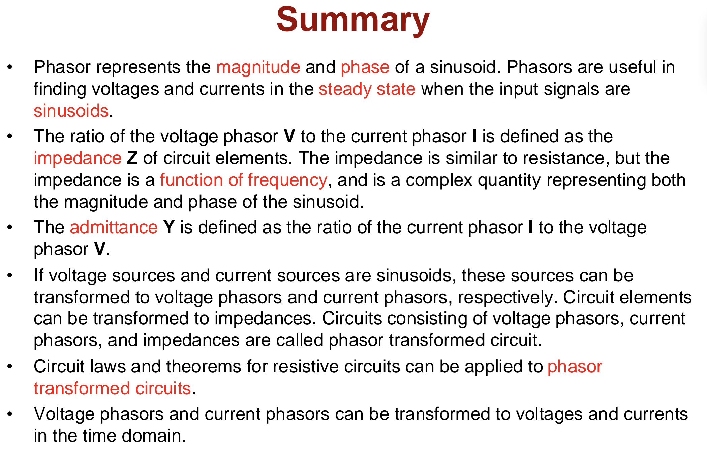

# Lecture 15 : AC Circuits（交流电路）

## Sinusoidal Signals（正弦信号）

一个标准的余弦波形可以写成如下的形式：

$$
v(t)=V_m\cos(\frac{2\pi}{T}t+\Phi)
$$

这个波形有三个参数： $V_m$ 是振幅， $T$ 是周期， $\Phi$ 是相位。

这个信号的频率 $f=\frac{1}{T}$ ，角频率 $\omega=2\pi f=\frac{2\pi}{T}$ 。

所以这个信号也可以写成：

$$
v(t)=V_m\cos(\omega t+\Phi)
$$

相位 $\Phi$ 为正则信号整体左移，为负则信号整体右移。同样的， $\sin$ 函数也可以看作是 $\cos$ 函数提前了 $\frac{\pi}{2}$ 的结果

## RMS Value（均方根值）

对于一个正弦信号 $v(t)=V_m\cos(\omega t +
\theta_v)$ ，它的峰值(peak amplitude)是 $V_p=V_m$ ，峰峰值(peak-to-peak amplitude)是 $V_{p-p}=2V_m$。

对于 $v(t)$ 的有效值，定义是他的均方根值

首先先计算 $v(t)$ 的均方值(mean square) $V_{ms}$ ：

$$
V_{ms}=\frac{1}{T}\int_{-\frac{T}{2}}^{\frac{T}{2}}v^2(t)dt=\frac{V_m^2}{2}+\frac{V_m^2}{2T}\frac{[\sin(2\omega t+2\theta_v)]^\frac{T}{2}_{-\frac{T}{2}}}{2\omega}
$$

$$
\Rightarrow V_{ms}=\frac{V_m^2}{2}+\frac{V_m^2}{2T}\frac{\sin(2\theta_v)-\sin(2\theta_v)}{2\omega}=\frac{V_m^2}{2}
$$

然后计算均方根值(root mean square) $V_{rms}$ ：

$$
V_{rms} = \sqrt{\lim_{T_0\rightarrow\infty}\frac{1}{T_0}\int_{-\frac{T_0}{2}}^{\frac{T_0}{2}}v^2(t)dt}=\sqrt{\frac{V_m^2}{2}}=\frac{V_m}{\sqrt{2}}
$$

有效值的意义是在相同时间内该信号产生的热量和有效值大小的直流信号相同。

## Phasor（相量）

根据欧拉方程：

$$
e^{i\theta}=cos\theta+i\sin\theta
$$
$$
Re[e^{i\theta}] = \cos\theta,
Im[e^{i\theta}] = \sin\theta
$$

类似的，我们可以得出：

$$
V_m e^{i(\omega t+\Phi)}=V_m\cos(\omega t+\Phi)+jV_m\sin(\omega t+\Phi)
$$

$$
Re[V_m e^{i(\omega t+\Phi)}]=V_m\cos(\omega t+\Phi)
$$

$$
Im[V_m e^{i(\omega t+\Phi)}]=V_m\sin(\omega t+\Phi)
$$

于是我们可以用一个复数来表示一个正弦信号，这个复数的实部是信号的实部，虚部是信号的虚部。此时 $V_m e^{i(\omega t+\Phi)}=V_m e^{i\Phi}e^{i\omega t}$ 相当于在复平面内的一个半径为V_m的圆上逆时针运动，运动的角速度是 $\omega \ \mathrm{rad/s}$ ，我们观测到的信号部分则是它的实部。

在开始位置时，有

$$
{V} = V_me^{i\Phi} = V_m\angle\Phi
$$

一般来讲，信号的幅度(magnitude) $V_m$ 被认为是非负的。如果给定的幅度是负的，我们认为它代表一个 $\pi$ 的相位差。

同样的，信号我们一般写作 $\cos$ 形式，如果给定的是 $\sin$ 形式，我们认为它是 $\cos$ 形式的 $\frac{\pi}{2}$ 相位差。

> 需要注意直角坐标系和极坐标系的转换的方法。

## Phasor Arithmetic（相量运算）

- 加法 & 减法
  - 先转换成直角坐标，再通过直角坐标下的向量进行运算并得到结果
  - $V_1\angle\theta_1+V_2\angle\theta_2=V_1\cos\theta_1+jV_1\sin\theta_1+V_2\cos\theta_2+jV_2\sin\theta_2=(V_1\cos\theta_1+V_2\cos\theta_2)+j(V_1\sin\theta_1+V_2\sin\theta_2)$
- 乘法 & 除法
  - 直接在极坐标系下进行运算
  - 幅度相乘，相位相加
  - $V_1\angle\theta_1\cdot V_2\angle\theta_2=V_1V_2\angle(\theta_1+\theta_2)$

## Impedance and Admittance（阻抗和导纳）

### Impedance（阻抗）

如果一个正弦的输入信号传递给电阻、电容、电感，它的输出信号也是正弦信号，只是幅度和相位会发生变化。

如果输入信号是 $v(t)$ ，同时输出信号是 $i(t)$ ，那么我们可以定义输入信号的复数形式为 ${V}$ ，输出信号的复数形式为 ${I}$ ，那么他们之间的关系可以表示为：

$$
{Z}=\frac{{V}}{{I}}
$$

${Z}$ 称为阻抗(impedance)，单位是欧姆。它是一个关于输入信号的频率的复数。我们通常把它写成

$$
{Z}=R+jX
$$

其中，R 是阻抗的实部，称为电阻(resistance)，单位是欧姆；X 是阻抗的虚部，称为电抗(reactance)，单位是欧姆。

### Admittance（导纳）

对于相量，欧姆定律可以写成：

$$
{Z} = \frac{{V}}{{I}}
$$

其中， ${Z}$ 的倒数称为导纳(admittance)，记作 ${Y}$ ，单位是西门子(Siemens)，记作 $S$ 。

$Y$ 也是一个复数，可以写成：

$$
{Y}=G+jB
$$

其中，G 是导纳的实部，称为电导(conductance)，单位是西门子；B 是导纳的虚部，称为电纳(susceptance)，单位是西门子。

## 电阻、电容、电感的阻抗和导纳

### 电阻

根据欧姆定律，有：

$$
v(t)=Ri(t)
$$

所以，可以得出：

$$
{Z}_R=R
$$
$$
{Y}_R=G=\frac{1}{R}
$$

### 电容

根据电容的电压电流关系，有：

$$
i(t)=C\frac{dv(t)}{dt}
$$
$$
v(t)=Re[{V} e^{i\omega t}],
{V}=V_m e^{i\Phi}=V_m\angle\Phi
$$
$$
i(t)=Re[{I} e^{i\omega t}],
{I}=(j\omega C){V}
$$

可得：

$$
{Y}_C=j\omega C
$$
$$
{Z}_C=\frac{1}{j\omega C}=-\frac{j}{\omega C}=\frac{1}{\omega C}\angle-\frac{\pi}{2}
$$

### 电感

同样的，根据电感的电压电流关系，有：

$$
v(t)=L\frac{di(t)}{dt}
$$
$$
v(t)=Re[{V} e^{i\omega t}],
{V}=V_m e^{i\Phi}=V_m\angle\Phi
$$
$$
i(t)=\frac{1}{L}\int_{-\infty}^{t}v(\lambda)d\lambda = Re[V_me^{j\Phi}e^{j\omega t}]=Re[{I} e^{j\omega t}],
{I}=(j\omega L){V}
$$

可得：

$$
{Z}_L=j\omega L
$$
$$
{Y}_L=\frac{1}{j\omega L}=-\frac{j}{\omega L}=\frac{1}{\omega L}\angle-\frac{\pi}{2}
$$

## Phasor-Transformed Circuit（相量变换电路）

如果电路是一个交流电路，那么我们可以把电路中的电阻、电容、电感都转换成相量形式，这样我们就可以用相量的方法来分析电路。

由电压相量、电流相量、阻抗组成的电路被称为相量变换电路。

电阻电路使用的所有电路定律和方法都可以用于相量变换电路。比如KCL、KVL、Nodal Analysis、Mesh Analysis等。

## 阻抗的串联和并联

和电阻的运算法则类似，阻抗的串联和并联也有类似的运算法则。

### 串联

$$
V=V_1+V_2+\dots+V_n=IZ_1+IZ_2+\dots+IZ_n=IZ_{eq}
$$
$$
Z_{eq}=Z_1+Z_2+\dots+Z_n
$$

### 并联

$$
I=I_1+I_2+\dots+I_n=\frac{V}{Z_1}+\frac{V}{Z_2}+\dots+\frac{V}{Z_n}=\frac{V}{Z_{eq}}
$$
$$
\frac{1}{Z_{eq}}=\frac{1}{Z_1}+\frac{1}{Z_2}+\dots+\frac{1}{Z_n}
$$

或者也可以写作：

$$
Y_{eq}=Y_1+Y_2+\dots+Y_n
$$

---

## Summary

