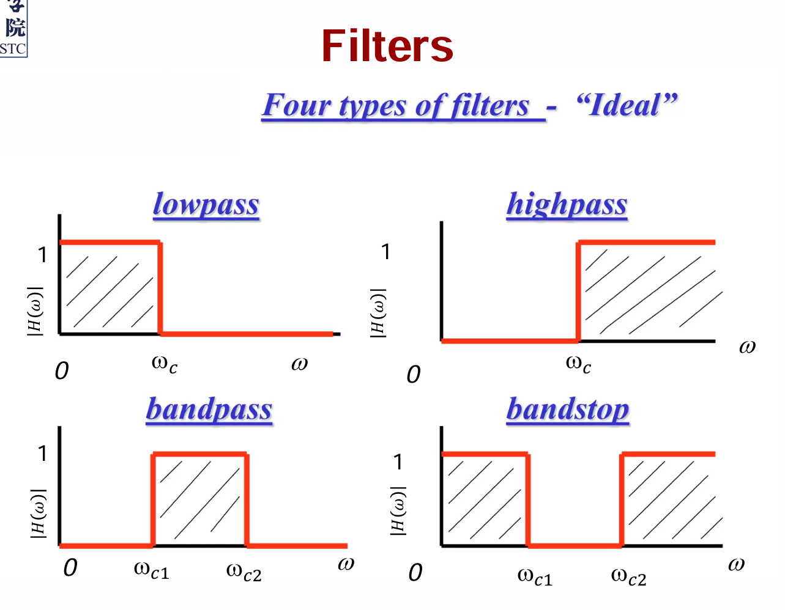
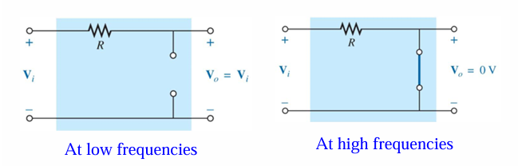

# Lecture 16 : First-Order Filters

## 前情提要

> 具体内容见：
>
> [Lecture 15 : AC Circuits](./Lecture15.md)

## Frequency Response / Transfer Function (频率响应 / 传递函数)

电路的频率响应(Frequency Responce)指的向电路里输入不同从0到无穷的频率信号时，输出的幅度和相位的变化。

对于一个电路，他的传递函数(Transfer Function)是输入和输出之间的关系，表示为 $H(\omega)$ ，其中 $\omega$ 是频率。它的定义是相量输出 $Y(\omega)$ 与相量输入 $X(\omega)$ 的比值。

传递函数有很多类型，比如：

- 电压的增益
  - $H(\omega)=\frac{V_{out}(\omega)}{V_{in}(\omega)}$
- 电流的增益
  - $H(\omega)=\frac{I_{out}(\omega)}{I_{in}(\omega)}$
- 阻抗
  - $H(\omega)=\frac{V_{out}(\omega)}{I_{in}(\omega)}$
- 导纳
  - $H(\omega)=\frac{I_{out}(\omega)}{V_{in}(\omega)}$

## Filter (滤波器)

### 理想滤波器

滤波器是指具有特定的传递函数的电路，用于过滤输入信号中的某些频率成分，允许一定的频率成分通过并阻止一定的频率成分。

滤波器有很多种类型，比如：

- 低通滤波器(Low-Pass Filter, LPF)
  - 允许低频信号通过，阻止高频信号通过
- 高通滤波器(High-Pass Filter, HPF)
  - 允许高频信号通过，阻止低频信号通过
- 带通滤波器(Band-Pass Filter, BPF)
  - 允许某一范围的频率信号通过，阻止其他频率信号通过
- 带阻滤波器(Band-Stop Filter, BSF)
  - 阻止某一范围的频率信号通过，允许其他频率信号通过

无法被物理实现的滤波器称为理想滤波器(Ideal Filter)，它的传递函数是矩形函数，即可以表现为多个阶跃函数的组合。

### 实际滤波器

然而，对于实际的电路，我们无法实现理想的滤波器，因为理想滤波器的传递函数是不连续的，无法通过电路来实现。在实际的滤波器中，通带并不会全为1，而阻带也不会全为0，并且通带与阻带之间会有一个过渡带。

实际的滤波器分为数字滤波器和模拟滤波器:

- 数字滤波器
  - 指的是用计算机或者特定设计的数字元件实现的滤波器，基于数字信号进行运算
- 模拟滤波器
  - 通常由模拟元件（如电阻、电感、电容、运算放大器）构成，基于模拟信号进行运算、
  - 可能是有源滤波器(Active Filter)或者无源滤波器(Passive Filter)
    - 无源滤波器是指不包含有源元件（如运算放大器）的滤波器，只包含被动元件（如电阻、电感、电容）
    - 有源滤波器是指包含有源元件的滤波器，通常包含运算放大器

### 滤波器的参数

- 陡降率(Roll-Off Rate)
  - 在阻带与通带之间的过渡带中，频率响应随频率变化的速率
- 截止频率(Cutoff Frequency)
  - 指的是滤波器的传递函数下降到 $1/\sqrt{2}$ 时的频率
  - 此处输出信号的功率为输入信号的一半，对应的增益大小是 $-3\ \text{dB}$
- 响应频率(Response Frequency)
  - 电容大小与感抗大小相等时的频率
  - 此时产生纯电阻的阻抗
  - 也是滤波器的中心频率
- 带宽(Bandwidth)
  - 适用于带通滤波器和带阻滤波器
  - 通带的频率范围
  - 对于一个带通滤波器，带宽是指上部的截止频率与下部的截止频率之间的频率范围
  - 带阻滤波器同理
- 品质因数(Quality Factor)
  - 反映了一个滤波器对于频率的选择性
  - 对于带通滤波器和带阻滤波器，品质因数是指中心频率与带宽之比
  - $Q$ 越大，滤波器的选择性越高，带宽越窄

## 一阶滤波器的分析

### RC 低通滤波器

$$
V_o(\omega) = \frac{\frac{1}{j\omega C}}{R + \frac{1}{j\omega C}} V_i(\omega) = \frac{1}{1 + j\omega RC} V_i(\omega) = \frac{\frac{1}{RC}}{j\omega + \frac{1}{RC}} V_i(\omega)
$$

$$
H(\omega) = \frac{V_o(\omega)}{V_i(\omega)} = \frac{\frac{1}{RC}}{j\omega + \frac{1}{RC}}
$$

于是，RC滤波器的增益的传递函数为：

$$
|H(\omega)| = \frac{1}{\sqrt{1 + (\omega RC)^2}}
$$

把传递函数写作极坐标形式，则有:

$$
H(\omega) = \frac{1}{\sqrt{1+(\omega RC)^2}} e^{ -j\arctan(\omega RC)} = \frac{1}{\sqrt{1+(\omega RC)^2}} \angle -\arctan(\omega RC)
$$

所以，RC滤波器的相位响应为：

$$
\angle H(\omega) = -\arctan(\omega RC)
$$

当直流输入时, $\omega = 0$ ， $|H(0)| = 1$ ， $\angle H(0) = 0$ 。最终输出的信号与输入信号相同。此时电容的阻抗为无穷大，相当于开路。

当 $\omega \rightarrow \infty$ 时， $|H(\infty)| = 0$ ， $\angle H(\infty) = -\frac{\pi}{2}$ 。最终输出的信号为0。此时电容的阻抗为0，相当于短路。

当截止频率时，有 $|H(\omega_c)| = \frac{1}{\sqrt{2}}$ ， $\angle H(\omega_c) = -\frac{\pi}{4}$ 。此时输出信号的幅度为输入信号的 $\frac{1}{\sqrt{2}}$ ，相位为 $-\frac{\pi}{4}$ 。可以代入求得 $\omega_c = \frac{1}{RC}$ ，即截止频率为 $\frac{1}{2\pi RC}$ 。

### CR 高通滤波器

类似的，有

$$
H(\omega) = \frac{j\omega RC}{1 + j\omega RC}
= \frac{\omega RC}{\sqrt{1 + (\omega RC)^2}} e^{j[\frac{\pi}{2} - \arctan(\omega RC)]}
$$

于是可以推得

$$
|H(\omega)| = \frac{\omega RC}{\sqrt{1 + (\omega RC)^2}}
$$

$$
\angle H(\omega) = \frac{\pi}{2} - \arctan(\omega RC)
$$

同样的，在 $\omega = 0$ 时， $|H(0)| = 0$ ， $\angle H(0) = \frac{\pi}{2}$ 。最终输出的信号为0。此时电容的阻抗为无限大，相当于开路；

在 $\omega \rightarrow \infty$ 时， $|H(\infty)| = 1$ ， $\angle H(\infty) = 0$ 。最终输出的信号与输入信号相同。此时电容的阻抗为0，相当于短路。

### RL 高通滤波器

$$
V_o(\omega) = \frac{j\omega L}{R + j\omega L}V_i(\omega)
$$

$$
H(\omega) = \frac{j\omega L}{R + j\omega L}
= \frac{\omega L}{\sqrt{R^2 + (\omega L)^2}} e^{j[\frac{\pi}{2} - \arctan(\frac{\omega L}{R})]}
$$

幅度增益和相位响应分别为：

$$
|H(\omega)| = \frac{\omega L}{\sqrt{R^2 + (\omega L)^2}}
$$

$$
\angle H(\omega) = \frac{\pi}{2} - \arctan(\frac{R}{\omega L})
$$

可以发现这是一个高通滤波器。

在截止频率时，可以求得 $\omega_c = \frac{R}{L}$ ，即截止频率为 $\frac{R}{2\pi L}$ 。此时输出信号的幅度为输入信号的 $\frac{1}{\sqrt{2}}$ ，相位为 $\frac{\pi}{4}$ 。

### LR 低通滤波器

可以求得：

$$
H(\omega) = \frac{R}{R + j\omega L} = \frac{R}{\sqrt{R^2 + (\omega L)^2}} e^{-j\arctan(\frac{\omega L}{R})}
$$

因此，幅度增益和相位响应分别为：

$$
|H(\omega)| = \frac{R}{\sqrt{R^2 + (\omega L)^2}}
$$

$$
\angle H(\omega) = -\arctan(\frac{\omega L}{R})
$$

可以发现这是一个低通滤波器。

在截止频率时，可以求得 $\omega_c = \frac{R}{L}$ ，即截止频率为 $\frac{R}{2\pi L}$ 。此时输出信号的幅度为输入信号的 $\frac{1}{\sqrt{2}}$ ，相位为 $-\frac{\pi}{4}$ 。

---

## Summary

