# Lecture 17 : Second-Order Filters

## 前情提要

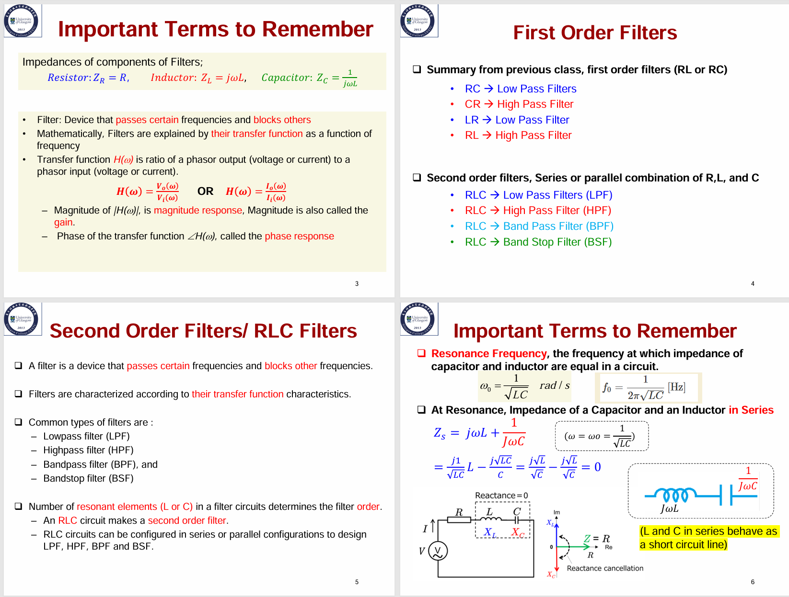

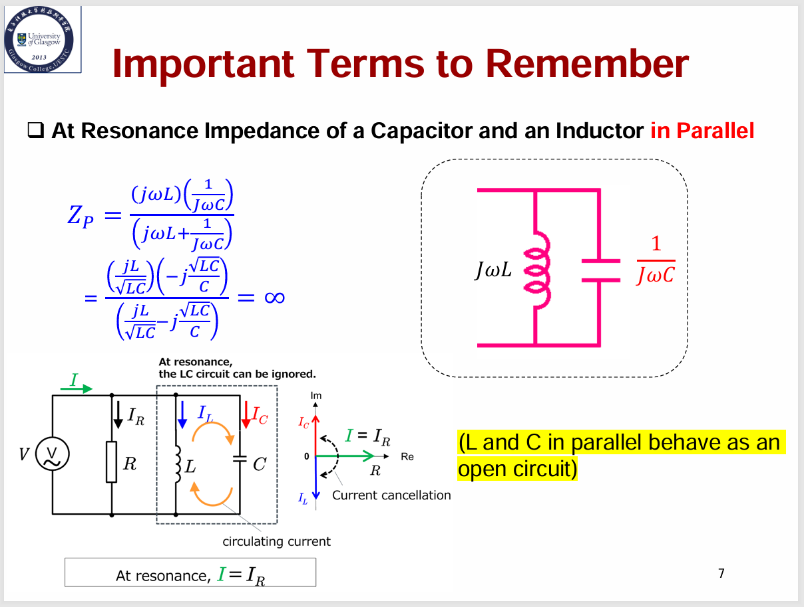

## RLC Filter Circuit (RLC滤波电路)

电路中谐振元件的数量决定了一个滤波器的阶数。只使用电阻的电路是一阶滤波器，只使用电感和电容的电路是二阶滤波器。同时使用电阻、电感和电容的电路组成的滤波器是RLC滤波器，是一个二阶滤波器。

通过调整电阻、电感和电容的值和连接方式，可以实现不同的滤波效果，如低通滤波、高通滤波、带通滤波和带阻滤波。

谐振频率(Resonance Frequency)指的是RLC电路中电感和电容的阻抗相同的频率。在这个频率下，电路的阻抗最小，电路中的电流最大。此时，阻抗与纯电阻表现相同，电路中的电流与电压的相位差为0。

可以推得，对于串联和并联RLC电路，谐振频率都为：

$$
\omega_0 = \frac{1}{\sqrt{LC}}
$$

$$
f_0 = \frac{1}{2\pi\sqrt{LC}}
$$

### RLC Series Filter Circuit (RLC串联滤波电路)

分析方法都是相同的：

- 写出 $R,L,C$ 的阻抗
- 通过相量法，用串联分压的方式计算出输出电压和输入电压之间的关系
- 将输出电压和输入电压的关系写成传递函数的形式

#### Series RLC LPF (串联RLC低通滤波器)

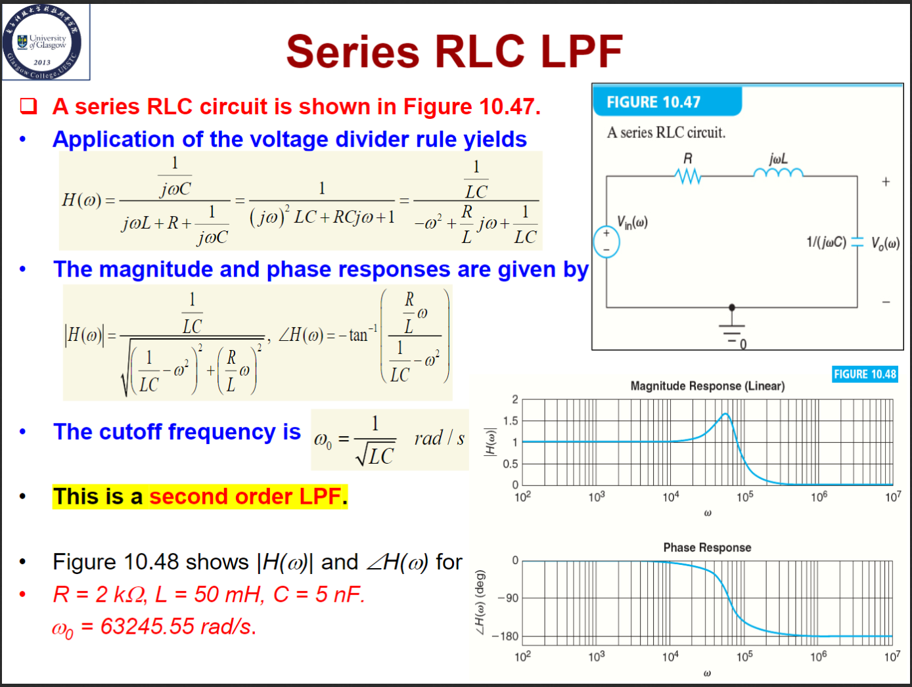

传递函数:

$$
H(\omega) = \frac{\frac{1}{LC}}{-\omega^2 + j\omega\frac{R}{L} + \frac{1}{LC}} = \frac{1}{\sqrt{(1-\omega^2LC)^2 + (\omega RC)^2}} e^{j[-\arctan(\frac{\omega RC}{1-\omega^2LC})]}
$$

$$
|H(\omega)| = \frac{1}{\sqrt{(1-\omega^2LC)^2 + (\omega RC)^2}}, \angle H(\omega) = -\arctan(\frac{\omega RC}{1-\omega^2LC})
$$

截止频率为：

$$
\omega_0 = \frac{1}{\sqrt{LC}}
$$

#### Series RLC HPF (串联RLC高通滤波器)

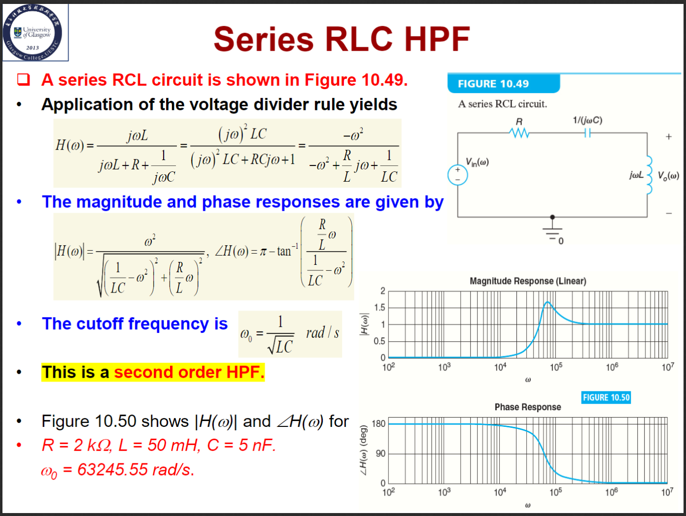

传递函数:

$$
H(\omega) = \frac{-\omega^2}{-\omega^2+\frac{R}{L}j\omega + \frac{1}{LC}} = \frac{\omega^2 LC}{\sqrt{(1-\omega^2LC)^2 + (\omega RC)^2}} e^{j[-\arctan(\frac{\omega RC}{1-\omega^2LC})]}
$$

$$
|H(\omega)| = \frac{\omega^2 LC}{\sqrt{(1-\omega^2LC)^2 + (\omega RC)^2}}, \angle H(\omega) = -\arctan(\frac{\omega RC}{1-\omega^2LC})
$$

截止频率为：

$$
\omega_0 = \frac{1}{\sqrt{LC}}
$$

#### Series RLC BPF (串联RLC带通滤波器)

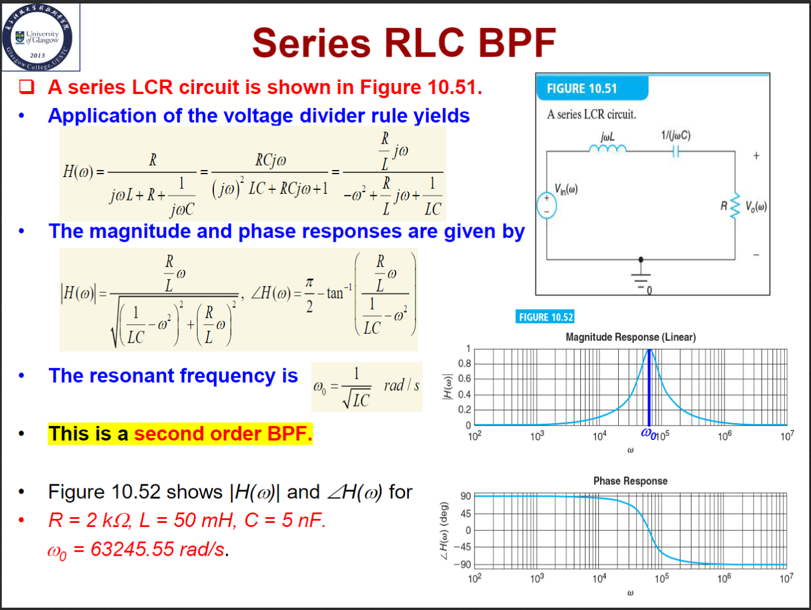

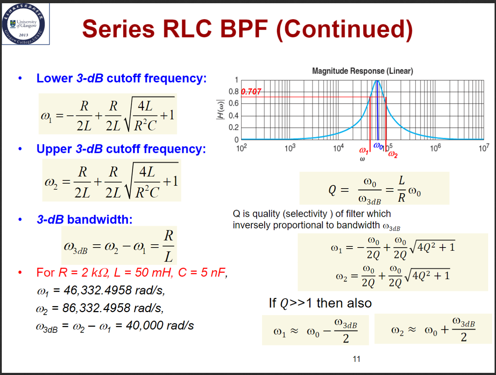

传递函数:

$$
H(\omega) = \frac{\frac{R}{L}j\omega}{-\omega^2+\frac{R}{L}j\omega + \frac{1}{LC}} = \frac{\omega RC}{\sqrt{(1-\omega^2LC)^2 + (\omega RC)^2}} e^{j[\frac{\pi}{2}-\arctan(\frac{\omega RC}{1-\omega^2LC})]}
$$

$$
|H(\omega)| = \frac{\omega RC}{\sqrt{(1-\omega^2LC)^2 + (\omega RC)^2}}, \angle H(\omega) = \frac{\pi}{2}-\arctan(\frac{\omega RC}{1-\omega^2LC})
$$

列方程后，解得下部、上部截止频率：

$$
\omega_1 = -\frac{R}{2L} + \frac{R}{2L}\sqrt{1+\frac{4L}{R^2C}},
\omega_2 = \frac{R}{2L} + \frac{R}{2L}\sqrt{1+\frac{4L}{R^2C}}
$$

因此，通带带宽为：

$$
\omega_{3dB} = \omega_2 - \omega_1 = \frac{R}{L}\sqrt{\frac{1}{LC}}
$$

带通滤波器的品质因数定义为其中心频率与通带带宽的比值：

$$
Q = \frac{\omega_0}{\omega_{3dB}} = \frac{L}{R}\omega_0 = \frac{1}{R}\sqrt{\frac{L}{C}}
$$

截止频率也可以用Q表示：

$$
\omega_1 = -\frac{\omega_0}{2Q}+\frac{\omega_0}{2Q}\sqrt{4Q^2+1},
\omega_2 = \frac{\omega_0}{2Q}+\frac{\omega_0}{2Q}\sqrt{4Q^2+1}
$$

因此，在 $Q \gg 1$ 时，有:

$$
\omega_1 \approx \omega_0-\frac{\omega_{3dB}}{2}, \omega_2 \approx \omega_0 + \frac{\omega_{3dB}}{2}
$$

#### Series RLC BSF (串联RLC带阻滤波器)

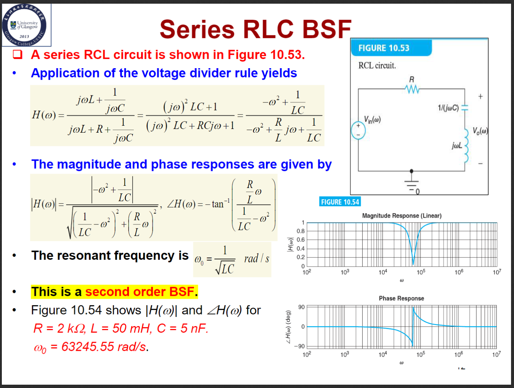

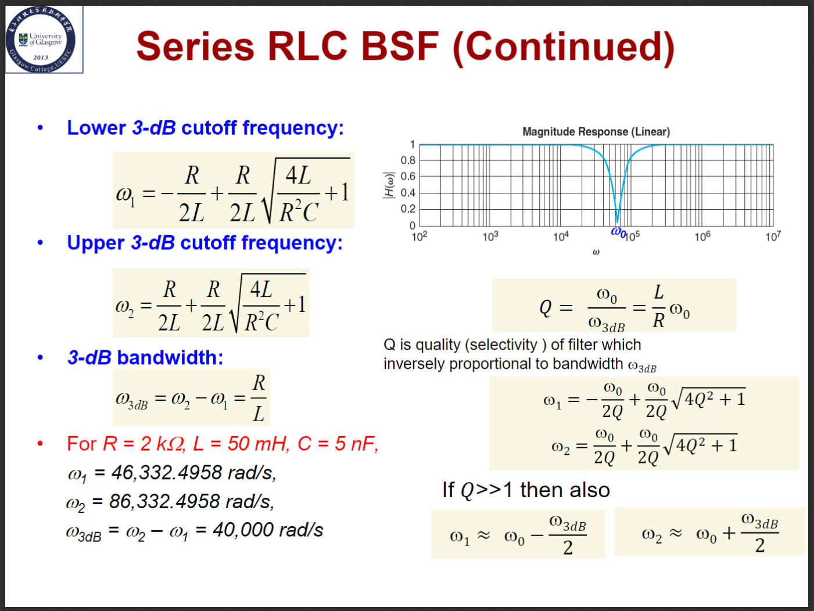

传递函数:

$$
H(\omega) = \frac{-\omega^2+\frac{1}{LC}}{-\omega^2+\frac{R}{L}j\omega + \frac{1}{LC}} = \frac{|1-\omega^2LC|}{\sqrt{(1-\omega^2LC)^2 + (\omega RC)^2}} e^{j[-\arctan(\frac{\omega RC}{1-\omega^2LC})]}
$$

$$
|H(\omega)| = \frac{|1-\omega^2LC|}{\sqrt{(1-\omega^2LC)^2 + (\omega RC)^2}}, \angle H(\omega) = -\arctan(\frac{\omega RC}{1-\omega^2LC})
$$

同理，列方程后，解得下部、上部截止频率：

$$
\omega_1 = -\frac{R}{2L} + \frac{R}{2L}\sqrt{1+\frac{4L}{R^2C}},
\omega_2 = \frac{R}{2L} + \frac{R}{2L}\sqrt{1+\frac{4L}{R^2C}}
$$

阻带宽度为：

$$
\omega_{3dB} = \omega_2 - \omega_1 = \frac{R}{L}
$$

品质因数为：

$$
Q = \frac{\omega_0}{\omega_{3dB}} = \frac{L}{R}\omega_0 = \frac{1}{R}\sqrt{\frac{L}{C}}
$$

$$
\omega_1 = -\frac{\omega_0}{2Q}+\frac{\omega_0}{2Q}\sqrt{4Q^2+1},
\omega_2 = \frac{\omega_0}{2Q}+\frac{\omega_0}{2Q}\sqrt{4Q^2+1}
$$

在 $Q \gg 1$ 时，有:

$$
\omega_1 \approx \omega_0-\frac{\omega_{3dB}}{2}, \omega_2 \approx \omega_0 + \frac{\omega_{3dB}}{2}
$$

### RLC Parallel Filter Circuit (RLC并联滤波电路)

> 非常好报菜名，爱来自 *B317*
>
> 敲公式敲红温了，不敲了。

#### Parallel RLC LPF (并联RLC低通滤波器)

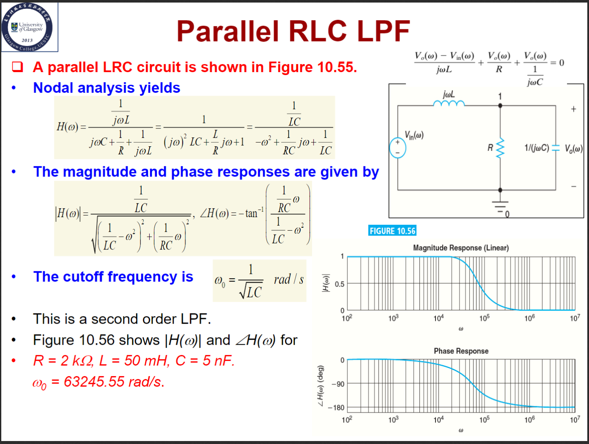

#### Parallel RLC HPF (并联RLC高通滤波器)

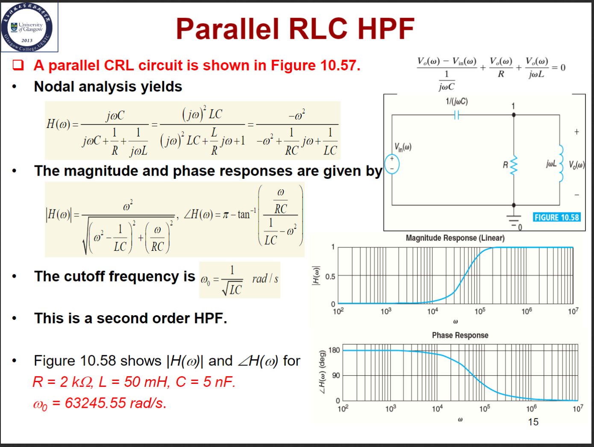

#### Parallel RLC BPF (并联RLC带通滤波器)

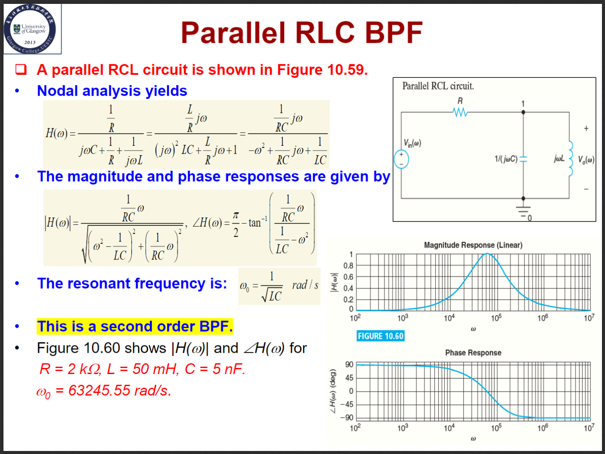

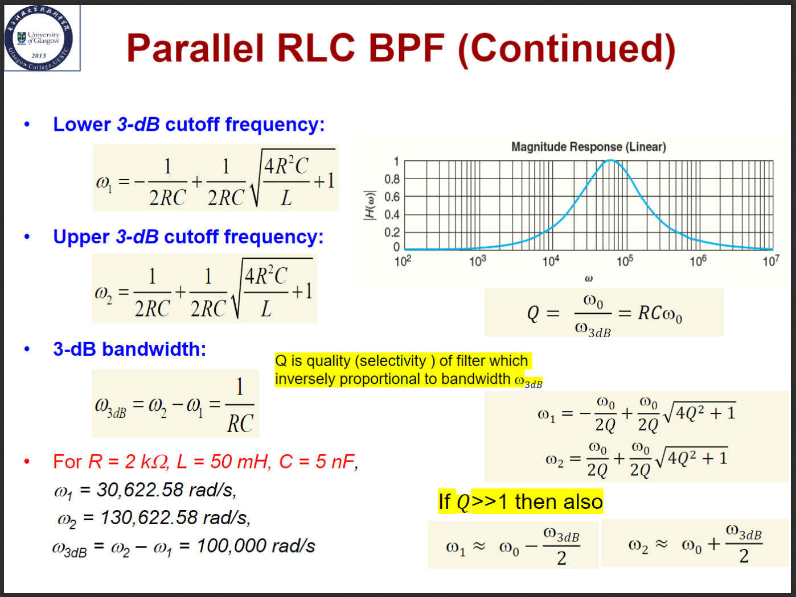

#### Parallel RLC BSF (并联RLC带阻滤波器)

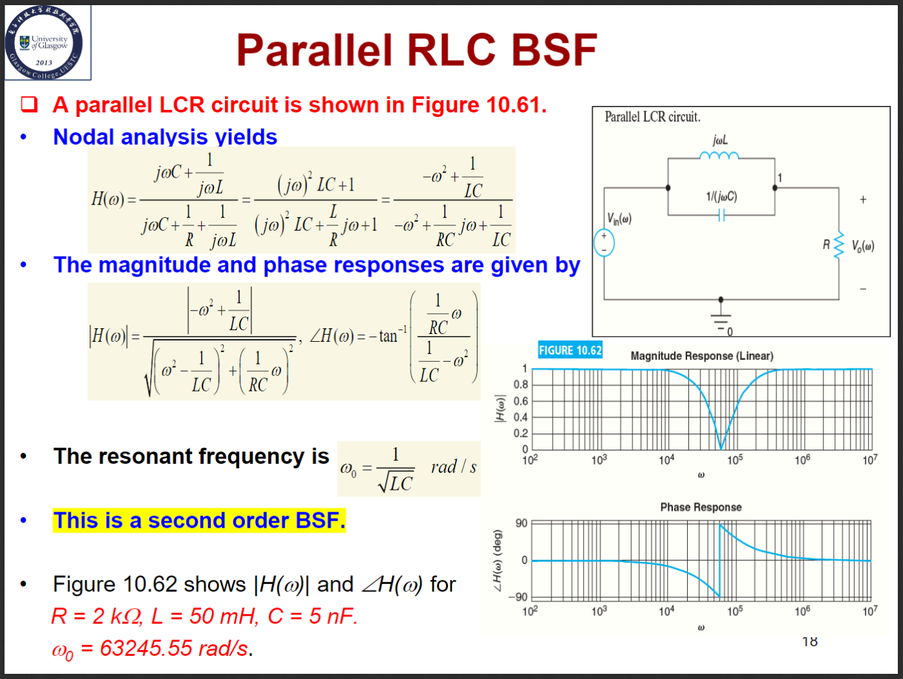

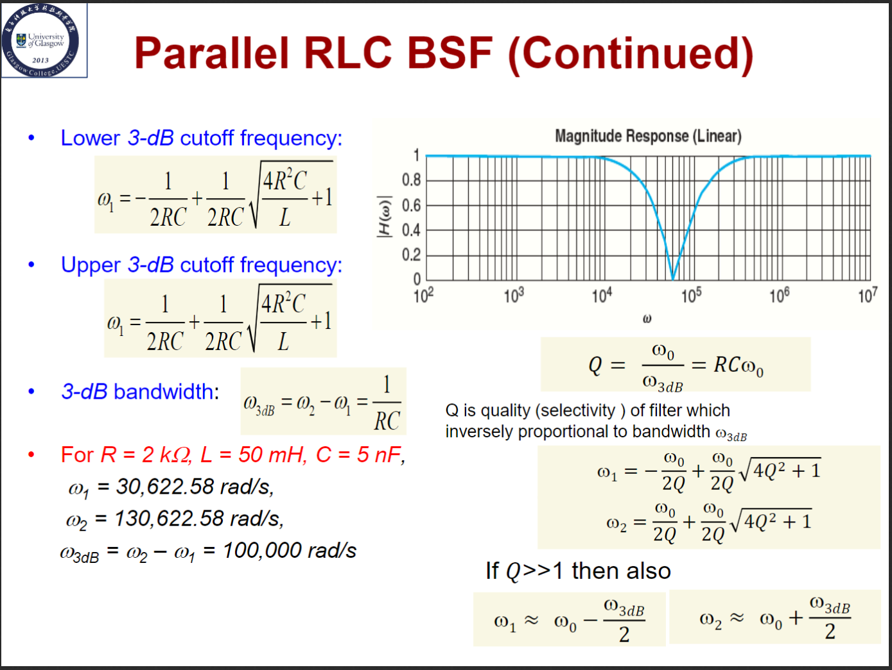

## Filter Design (滤波器设计)

> 你这是设计吗，你这不是纯计算吗

1. 确定谐振频率 $\omega_0$ 或者截止频率 $\omega_c$
2. 确定品质因数 $Q$ 和带宽 $\omega_{3dB}$ (或者是 $\omega_1$ 和 $\omega_2$ )

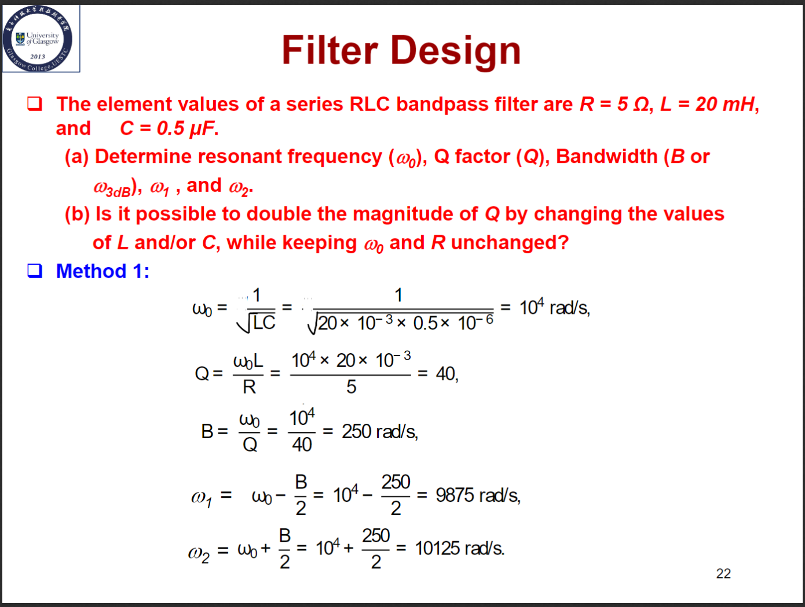

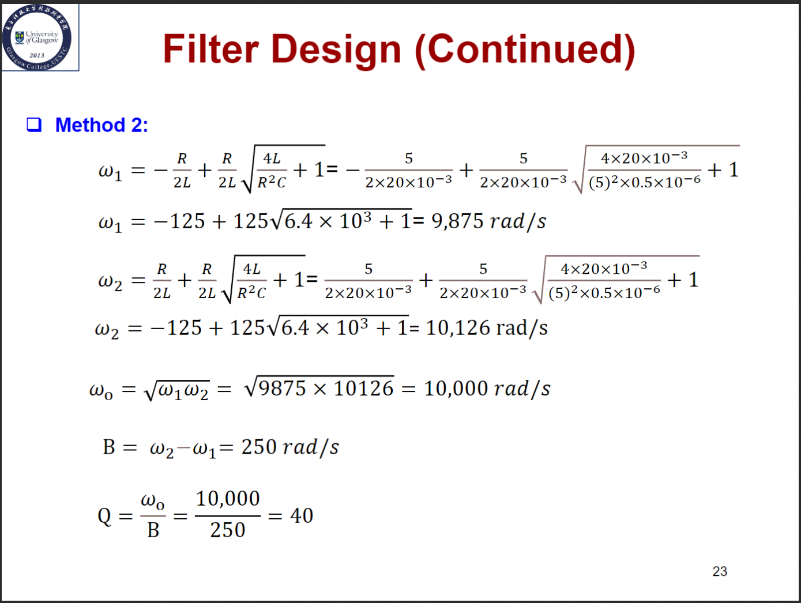

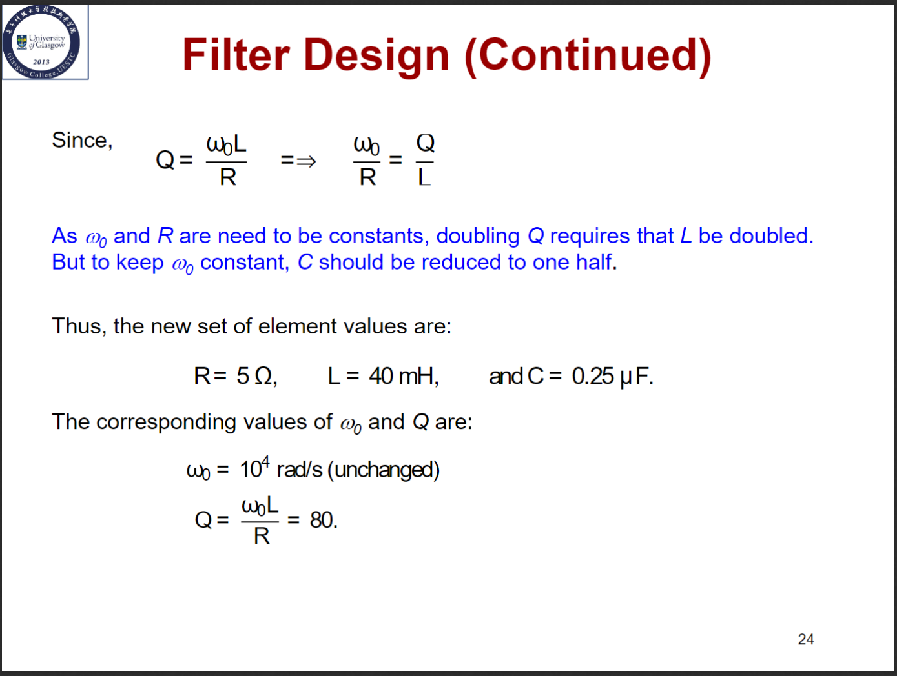

## 带宽与品质因数的关系

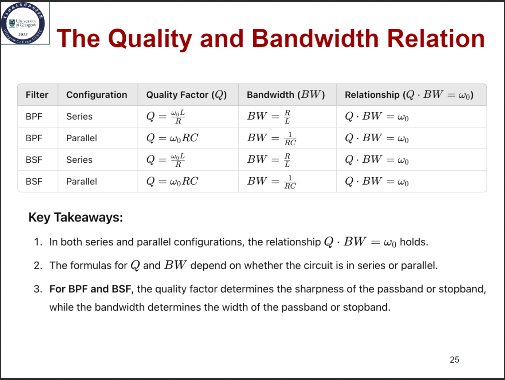

- 在滤波器中有恒等式 $Q\cdot BW = \omega_0$
- 公式中的Q(品质因数)和BW(带宽)和滤波器的结构有关
- 在带通滤波器和带阻滤波器中，品质因数决定了通带与阻带之间的过渡带的陡度(Sharpness)，同时也决定了通带/阻带的带宽

---

## Summary (总结)

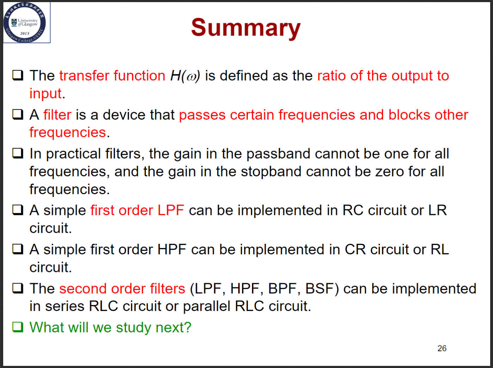
