# Lecture 18 : Operational Amplifiers (运算放大器)

## Ideal Op-Amp (理想运算放大器)

运算放大器(简称运放或OpAmp)是一种可以进行数学运算的电子设备。通过特定的电路结构，可以做到加法、减法、乘法、除法、积分、微分等运算。

要实现运算放大器的功能，通常需要较为复杂的电路，所以运放通常被封装成集成电路元件，如LM741。

运放常常用作放大器、滤波器、信号处理和仪器电路等。

下图是运算的表示符号和一般的封装方法。

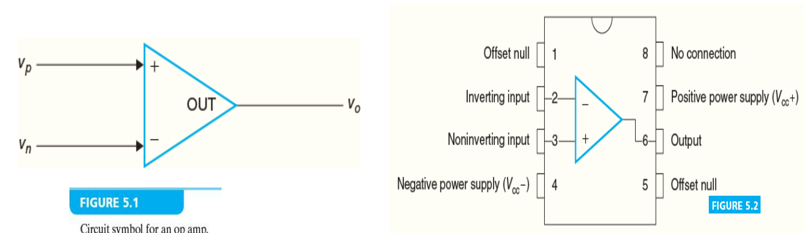

对于理想情况的运算放大器，它的电路模型可以抽象成这个样子：

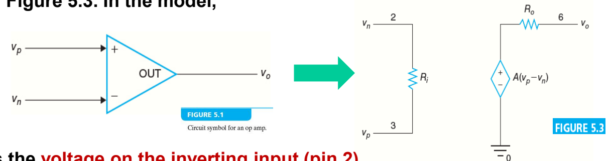

其中， $V_p$ 和 $V_n$ 分别是运放的正输入端和负输入端的电压， $V_{out}$ 是输出端的电压。 $R_i$ 是输入电阻， $R_o$ 是输出电阻, $A$ 是放大倍数。整个运算放大器可以表示为一个阻值相对很大的输入电阻和一个受控电压源两部分组成，其中受控电压源的电压等于输入电阻上的电压大小乘以放大倍数 $A$ 。这样的模型可以简化运算放大器的分析。

对一般的运放来说，输入电阻 $R_i$ 很大，输出电阻 $R_o$ 很小，放大倍数 $A$ 很大。而在最理想的情况下，我们认为 $R_i = \infty$ ， $R_o = 0$ ， $A = \infty$ 。

在理想情况下，我们再来看这个电路模型：

- 因为输入电阻 $R_i$ 理想情况下是无穷大，所以输入电流 $I_i = 0$ 。
  - 这被称为 ***虚断*** ，意思是输入电流为0，和两路输入信号断路的情况相似。
- 因为运算放大器的放大倍数 $A$ 足够大，在受控电压源输出一定电压时输入电阻上的电压足够小，在理想情况下我们认为 $V_{R_i} = 0$ ，即 $V_p = V_n$ 。
  - 这被称为 ***虚短*** ，意思是两路输入信号电势差为0，即 $V_p = V_n$ ，和短路的情况相似。

> 需要补充的一点是，因为运放的输入电阻足够大且输出电阻足够大，所以运放可以对前级电路影响较小，而对后级电路带载能力较强。
>
> 说的更好理解一些的话，就是几个后面提到的运放模块可以直接级联，而（几乎？）不用担心模块之间的耦合影响

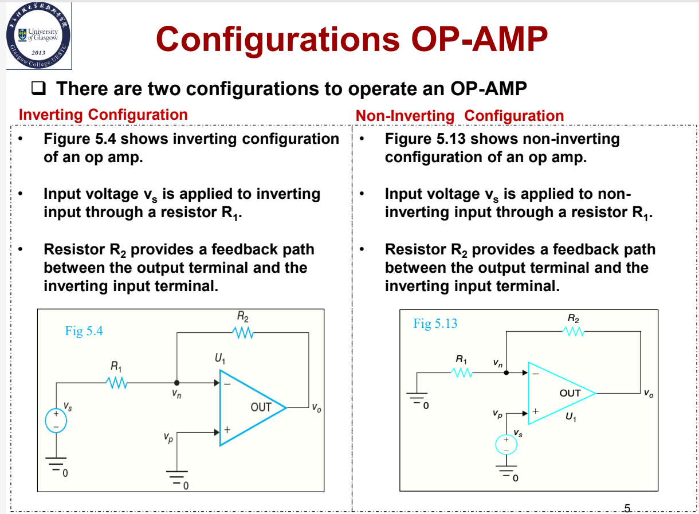

两种常见的运放电路结构：同相放大器和反相放大.

- 同相放大
  - 输入信号和输出信号同相，即输入信号和输出信号的电压变化方向相同。
  - 输入信号接在正输入端
- 反相放大
  - 输入信号和输出信号反相，即输入信号和输出信号的电压变化方向相反。
  - 输入信号接在负输入端

## Sum & Difference Amplifiers (求和放大器和差分放大器)

### Summing Amplifier (求和放大器)

#### Inverting Summing Amplifier (反相求和放大器)

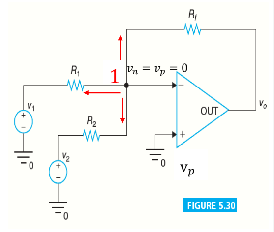

图上是一个典型的反相求和放大器的电路图。它的输出电压是 $V_o$ ，输入信号是 $V_1$ 和 $V_2$ , $R_f$ 是反馈电阻。

分析这个电路，可以通过对运放的负输入端处的节点列写节点分析方程。通过虚短我们可以得知此处的电势和接地点相同为0：

$$
\frac{0-v_1}{R_1} + \frac{0-v_2}{R_2} + \frac{0-v_o}{R_f} = 0
$$

整理得到：

$$
v_o = -(\frac{R_f}{R_1}v_1 + \frac{R_f}{R_2}v_2)
$$

设 $k_1 = \frac{R_f}{R_1}$ ， $k_2 = \frac{R_f}{R_2}$ ，则：

$$
v_o = -(k_1v_1 + k_2v_2)
$$

这样就得到了输入信号的加和，完成了求和放大器的功能。因为此处 $v_1$ 和 $v_2$ 都是负号，所以这是一个反相求和放大器。

如果我们不希望输出信号是反相的，我们可以让信号再次反相，即在输出端再接一个反相放大器。具体的电路图如图所示：

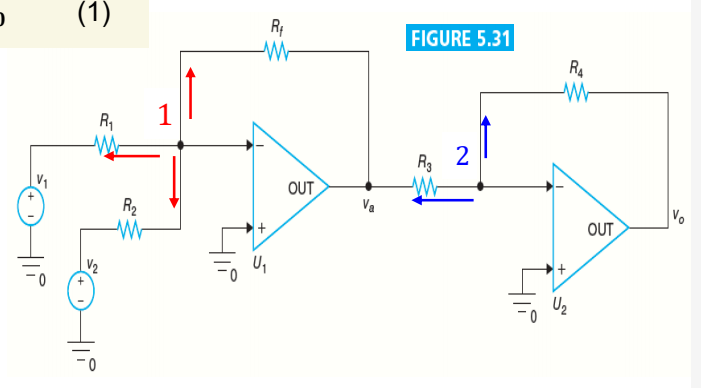

此处的 $v_a$ 即为之前的 $v_o$ ，同样的，列写节点分析方程，可得：

$$
\frac{0-v_a}{R_3} + \frac{0-v_o}{R_4} = 0
$$

整理可得：

$$
v_o = -\frac{R_4}{R_3}v_a = \frac{R_4}{R_3}(\frac{R_f}{R_1}v_1 + \frac{R_f}{R_2}v_2)
$$

这样，最后输出的信号就再次变成了正相。

同样的，如果需要把更多路的输入信号相加，可以添加连接到对应节点的支路数量，如图所示：

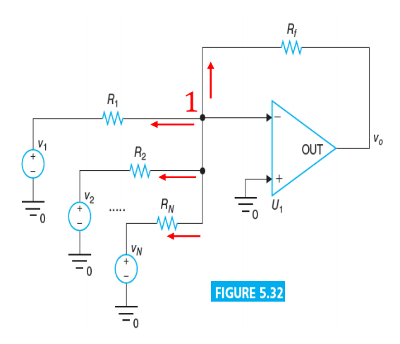

这样，最终的输出就是：

$$
v_o = -(\frac{R_f}{R_1}v_1+\frac{R_f}{R_2}v_2+\dots+\frac{R_f}{R_n}v_n)
$$

#### Non-inverting Summing Amplifier (同相求和放大器)

求和放大器还有另一种结构，即同相求和放大器。同相求和放大器的电路图如下：

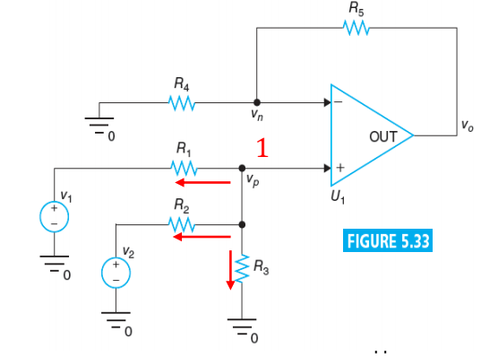

同样的，我们可以列写节点分析方程：

$$
\begin{cases}
\frac{v_n-v_o}{R_5} + \frac{v_n}{R_4} = 0   \\
\frac{v_p-v_1}{R_1} + \frac{v_p-v_2}{R_2} + \frac{v_p}{R_3} = 0 \\
v_n = v_p
\end{cases}
$$

解得：

$$
v_o = \frac{1}{\frac{1}{R_1}+\frac{1}{R_2}+\frac{1}{R_3}}\frac{R_4+R_5}{R_4}(\frac{v_1}{R_1}+\frac{v_2}{R_2})
$$

可以发现，输出的信号与输入信号仍然是同相的。

对于多个输入，和反相求和放大器类似：

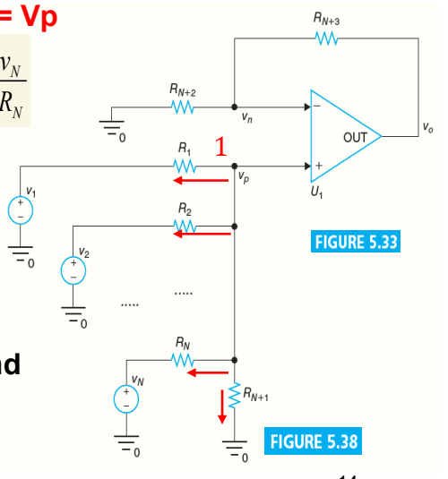

列写节点分析方程，解出方程可以得到：

$$
v_o = \frac{1}{\frac{1}{R_1}+\dots+\frac{1}{R_{N+1}}}\frac{R_{N+2}+R_{N+3}}{R_{N+2}}(\frac{v_1}{R_1}+\dots+\frac{v_N}{R_N})
$$

### Difference Amplifier (差分放大器)

对于一个差分放大器，电路图是这样的：

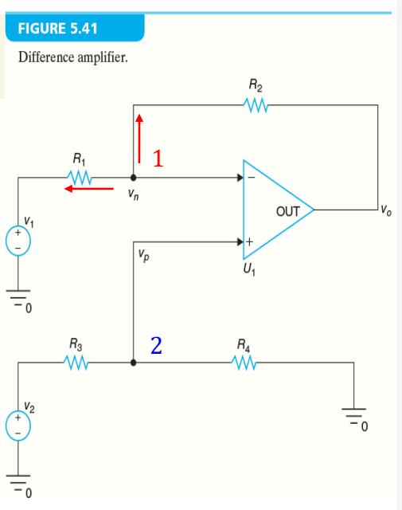

同样的列写节点分析方程：

$$
\begin{cases}
    v_p = v_n   \\
    \frac{v_n-v_1}{R_1} + \frac{v_n-v_o}{R_2} = 0   \\
    \frac{v_p-v_2}{R_3} + \frac{v_p}{R_4} = 0
\end{cases}
$$
解得：
$$
v_o = (\frac{R_1+R_2}{R_1})(\frac{R_4}{R_3+R_4})v_2-\frac{R_2}{R_1}v_1
$$

可以发现，输出的信号是输入信号的(乘以一定倍数后的)差值。这样就完成了差分放大器的功能。

## Analysis of Op-Amp Circuits (运算放大器电路的分析)

对于运算放大器的电路，我们可以通过虚短和虚断的方法来简化分析。我们假设输入电阻 $R_i = \infty$ ，输出电阻 $R_o = 0$ ，放大倍数 $A = \infty$ 。

### Analysis of inverting configuration (反相放大器的分析)

使用的方法和我们之前分析反相放大器的方法类似，列写节点分析方程，解出方程即可得到输出电压和输入电压之间的关系。

此处只是把运放的符号用运放的电路模型代替了，列写KCL方程仍然能搞定。

这种分析方式是用来分析运放没有那么理想的情况，即 $R_i$ 不是无穷大， $R_o$ 不是0， $A$ 不是无穷大的情况。使用这样的分析可以得到更加贴合实际的结果。

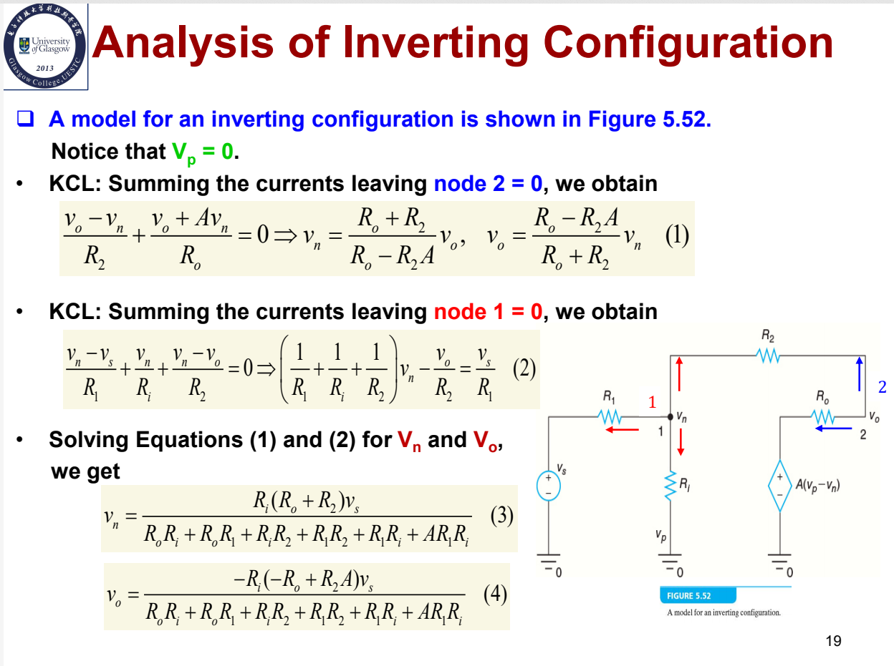

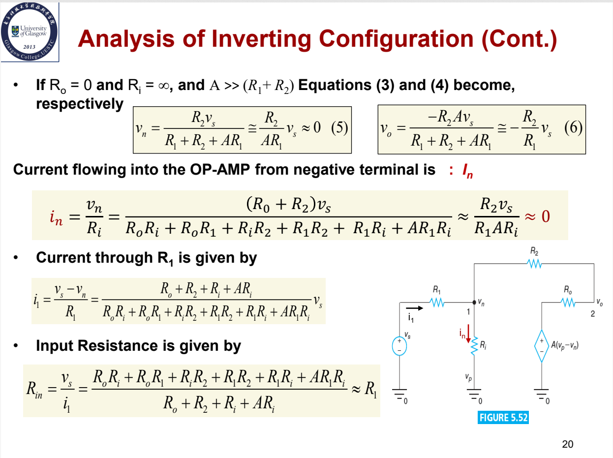

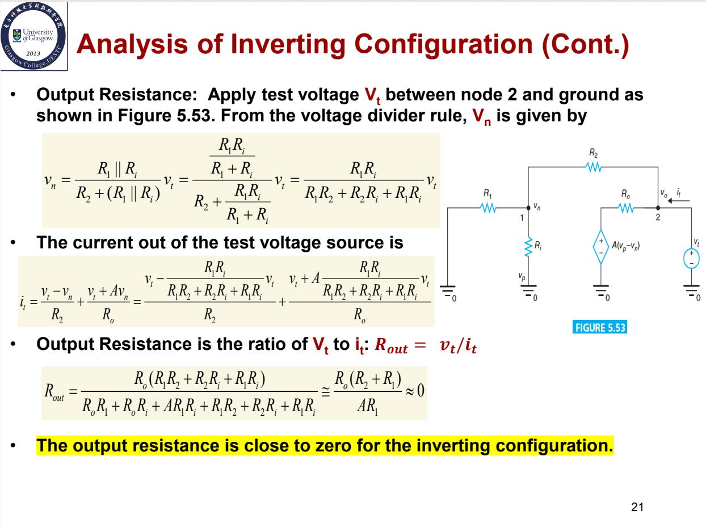

### Analysis of non-inverting configuration (同相放大器的分析)

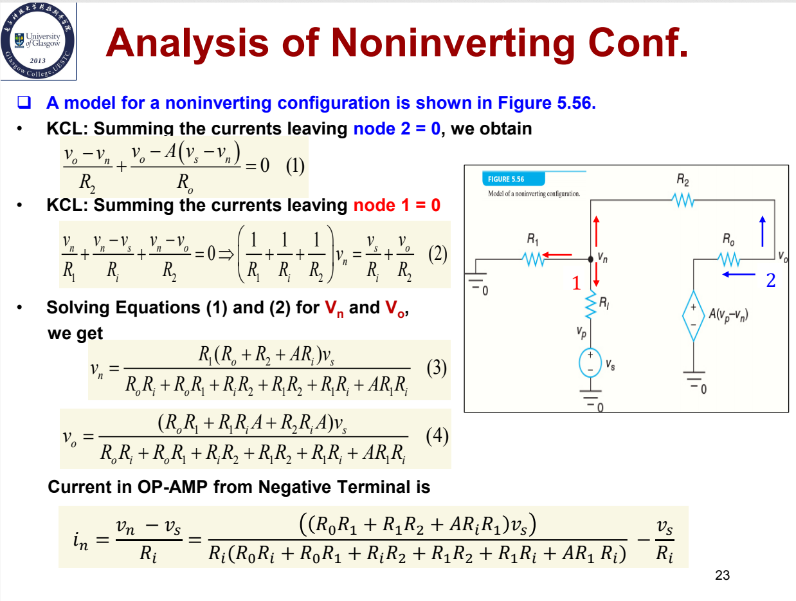

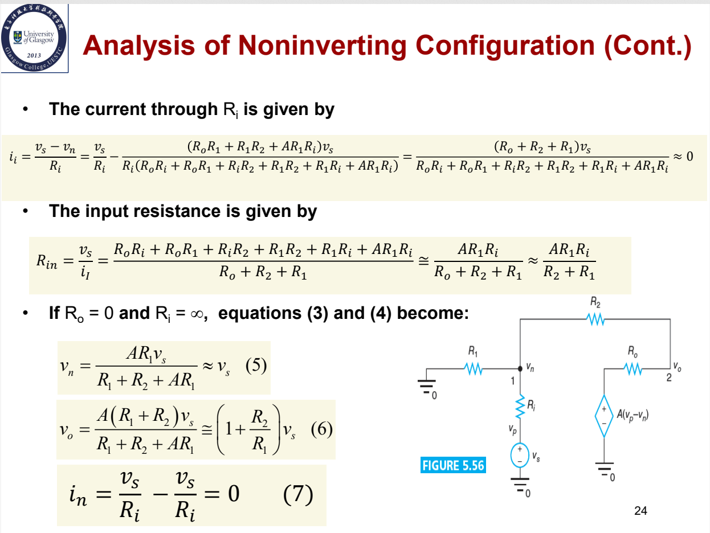

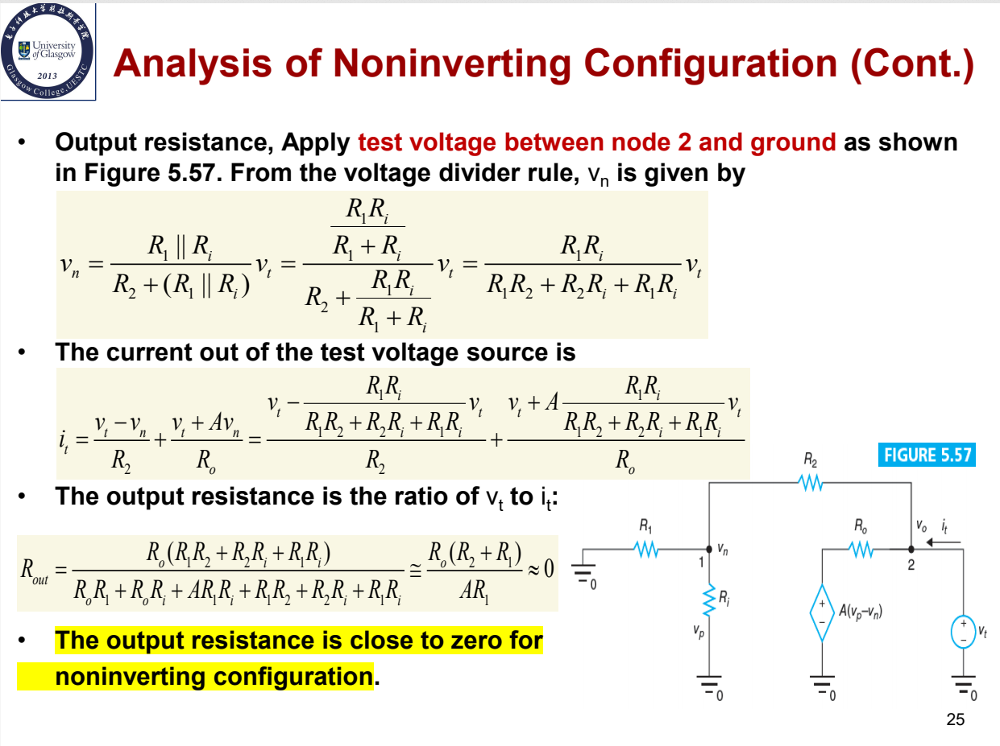

---

## Summary

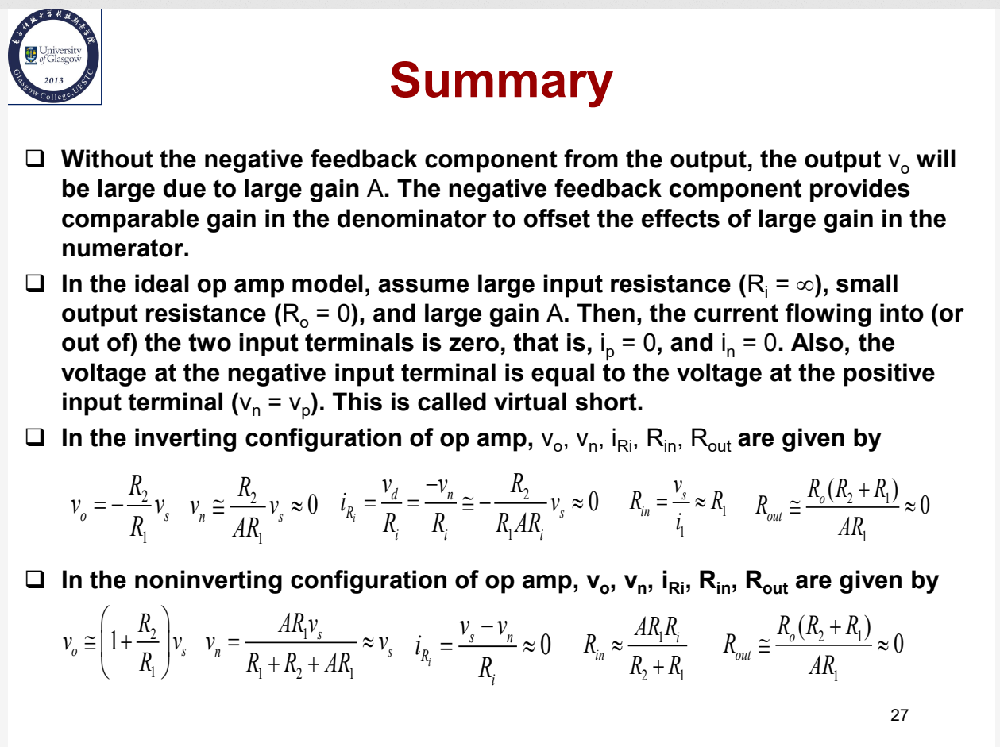

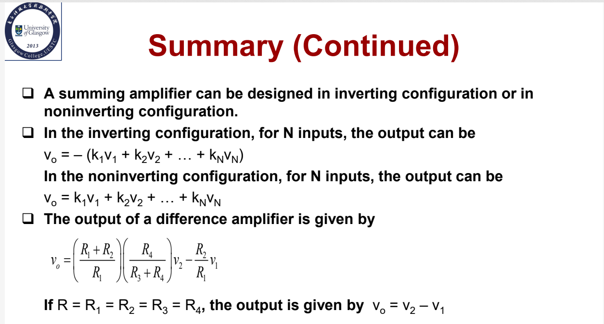
