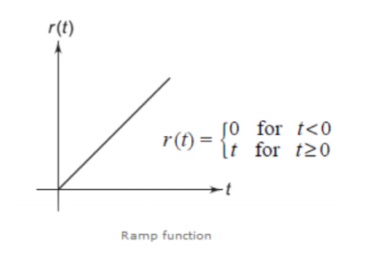

# Lecture 2 : Source（电源） & Element Signals（基本信号）

## Source（电源）

电源，分为电流源和电压源。对于理想的电流源和理想的电压源，他们有这样的性质：

- 理想电流源
  - 我们认为通过理想电流源的电流大小恒为它的电流值，而电流源两端的电压大小可以是任意值
  - 此处提及的“电流值”可以是一个函数，也可以是一个常数
  - 如果电流源的电流值是一个常数，那么我们称之为恒流源
  - 如果电流源的电流值是一个函数，那么我们称之为变流源
  - 如果函数值在正负之间变化，那么我们称之为交流源
- 理想电压源
  - 我们认为通过理想电压源的电流大小可以是任意值，而电压源两端的电压恒为它的电压值
  - 此处提及的“电压值”可以是一个函数，也可以是一个常数
  - 如果电压源的电压值是一个常数，那么我们称之为恒压源
  - 如果电压源的电压值是一个函数，那么我们称之为变压源
  - 如果函数值在正负之间变化，那么我们称之为交压源

电压源的表示方法如图所示：

而电流源的表示方法如图：

### Source Transformation（电源变换）

多个电源可以通过电源变换的方式转换为一个电源。电源变换的规则如下：

- 电压源串联
  - 电压源串联时，电压值相加，电流值不变
- 电压源并联
  - 电压源并联时，电压值不变，电流值相加

### Dependent Source（受控源）

受控源是一个电源，它的电压值或者电流值是由电路中的其他元件决定的。受控源的种类有：

- 电压控制电压源（VCVS）
  - 电压控制电压源的电压值是由电路中的电压决定的
- 电流控制电压源（CCVS）、
  - 电流控制电压源的电压值是由电路中的电流决定的
- 电压控制电流源（VCCS）
  - 电压控制电流源的电流值是由电路中的电压决定的
- 电流控制电流源（CCCS）
  - 电流控制电流源的电流值是由电路中的电流决定的

四种类型的受控源的区别主要在于其输出电流/电压的关于某个受控量的函数关系。

受控源的表示方法如图所示：

## Element Signals（基本信号）

**函数** 的定义是两个物理量之间的关系，输入一个量后输出一个量，用 $f(x)$ 表示。而 **信号** 是随时间变化的函数，用 $f(t)$ 表示。

此处介绍的常用的几个信号：

- Sinusoidal Signal（正弦信号）
- Dirac Delta Function（德尔塔函数）
- Unit Step Function（单位阶跃函数）
- Ramp Function（斜坡函数）
- Rectangular Pulse Function（矩形脉冲函数）
- Triangular Pulse Function（三角脉冲函数）

### Dira Delta Function（德尔塔函数）

德尔塔函数是一个在 $t=0$ 时刻的脉冲信号。我们首先先定义一个矩形脉冲函数：

$$
f(t) = \frac{1}{\tau} rect(\frac{t+\frac{\tau}{2}}{\tau})
$$

此时，让 $\tau \to 0$ ，我们就得到了德尔塔函数：

$$
\delta(t) = \lim_{\tau \to 0} \frac{1}{\tau} rect(\frac{t+\frac{\tau}{2}}{\tau})
$$

德尔塔函数的性质：

- 非常窄，但是面积为1
- 任意函数与德尔塔函数的卷积等于原函数在 $t=0$ 处的值
- 德尔塔函数的导数是一个矩形脉冲函数
- 德尔塔函数的积分是一个单位阶跃函数

### Unit Step Function（单位阶跃函数）

单位阶跃函数是一个在 $t=0$ 时刻突然跳变的函数：

$$
u(t) = \begin{cases}
0, & t < 0 \\
1, & t \ge 0
\end{cases}
$$

可以发现，单位阶跃函数的导数是德尔塔函数：

$$
\frac{du(t)}{dt} = \delta(t)
$$

如果我们需要表示在 $(a,b)$ 时间段内的单位阶跃函数，我们可以用 $u(t-a)-u(t-b)$ 或者 $H(t-b)\cdot u(t-a)$ 来表示。常用的还是减法的形式，因为利于求导和积分操作。

### Ramp Function（斜坡函数）

斜坡函数是单位阶跃函数的积分：

$$
r(t) = \int u(t) dt = \begin{cases}
0, & t < 0 \\
t, & t \ge 0
\end{cases}
$$

### Exponential Function（指数函数）

指数函数是一个以 $e$ 为底的幂函数：

$$
f(t) = e^{-at}u(t), a > 0
$$

把指数函数乘上余弦或者正弦函数，我们就得到了指数衰减的余弦/正弦信号：

$$
f(t) = e^{-at}cos(\omega t)u(t)
$$

$$
f(t) = e^{-at}sin(\omega t)u(t)
$$

### Rectangular Pulse Function（矩形脉冲函数）

矩形脉冲函数是一个在0周围 $T$ 时间段内的单位阶跃函数：

$$
f(t) = A rect(\frac{t}{T}) = \begin{cases}
A, & |t| < \frac{T}{2} \\
0, & |t| > \frac{T}{2}
\end{cases}
$$

### Triangular Pulse Function（三角脉冲函数）

三角脉冲函数是一个在0周围 $T$ 时间段内的斜坡函数：

$$
f(t) = A tri(\frac{t}{T}) = \begin{cases}
\frac{2A}{T}t + A, & -\frac{T}{2} < t < \frac{T}{2} \\
0, & |t| > \frac{T}{2}
\end{cases}
$$

---

## Summary

