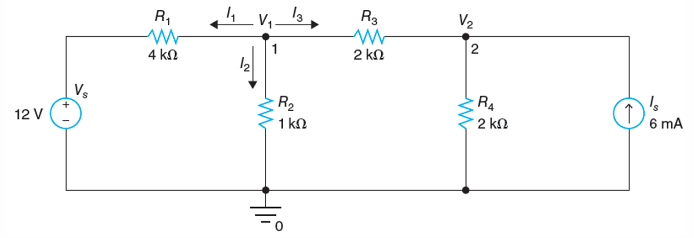
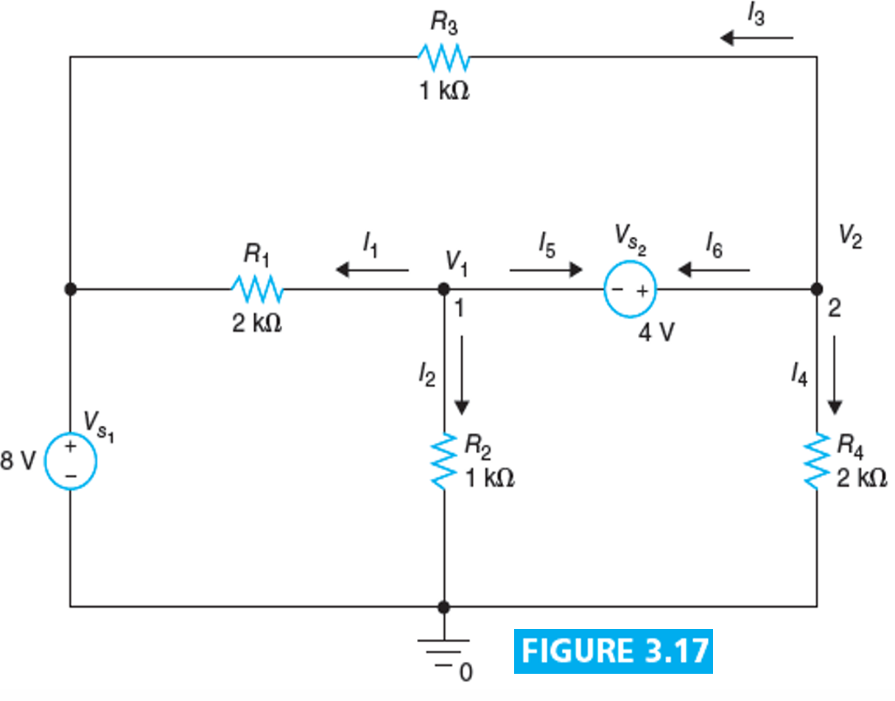

# Lecture 5 : Nodal Analysis & Supernode

## Nodal Analysis（节点分析法）

节点分析法是一种基于电路中节点电压的分析方法，它的基本思想是：在电路中选取一个参考节点，对于每一个非参考节点，都可以通过其与参考节点之间的电压来表示。这样，我们就可以通过节点电压的关系来建立方程，从而求解电路中各个节点的电压。

我们通常把这个参考节点的电压值视为0，也就是与GND短接。

节点分析法的基本原理是KCL（Kirchhoff's Current Law，基尔霍夫电流定律），即电路中每一个节点流入电流与流出电流相等。

如果一个电路中有N个相互独立的，我们把其中一个节点视为电势为0，那么对于其他的节点，我们可以写出 N-1 个相互独立的节点方程，而 N-1 个方程可以求解 N-1 个未知数，即电路中 N-1 个节点的电压。

如果电路中有独立的电压源，我们可以通过电压源的电压值直接得到一个节点的电压，这样我们就可以通过 N-1 个方程求解 N-1 个未知数。而如果电路中有多个电压源而并不能通过电压源直接得到某个节点的电压，我们就需要通过超节点的方法来求解。

举个例子：

对于这样的电路，我们可以一共找到 **三个节点** 。我们把底下的结点设为参考节点，电势为0，那么对于上面的两个节点，我们可以设两个未知量 $V_1$ 和 $V_2$ ，然后我们可以通过 KCL 来写出两个方程：

对于 $V_1$ ：

$$
\frac{V_1 - V_s}{R_1} + \frac{V_1}{R_2} + \frac{V_1 - V_2}{R_3} = 0
$$

对于 $V_2$ ：

$$
\frac{V_2 - V_1}{R_3} + \frac{V_2}{R_4} + (-I_s) = 0
$$

解这个方程组，我们就可以得到 $V_1$ 和 $V_2$ 的值。

## Supernode（超节点）

如果两个节点之间有一个电压源，我们就可以通过超节点的方法来求解。超节点的意思是把两个节点之间的电压源当作一个整体，从而建立一个方程。

同样的还是进行线性方程组的联立，求得各个节点的电压。

比如，对于一个这样的电路：

这个电路中有两个电压未知的节点由一个理想电压源连接，我们可以通过超节点的方法来求解。即设电压源左侧节点为 $V_1$ ，右侧节点为 $V_2$ ，那么有：

$$
V_2 - V_1 = V_{s_2}
$$

把电压源两端的两个节点看作一个整体，我们可以得到：

$$
\frac{V_1 - V_{s_1}}{R_1} + \frac{V_1}{R_2} + \frac{V_2}{R_4} + \frac{V_2 - V_{s_1}}{R_3} = 0
$$

我们这样写相当于把两个节点分开的KCL方程加在一起，消掉通过电压源的电流，得到一个新的方程。这个方程是把两个节点的输入输出电流一起写出来加和的结果。所以这个方程叫做**超节点方程**。
