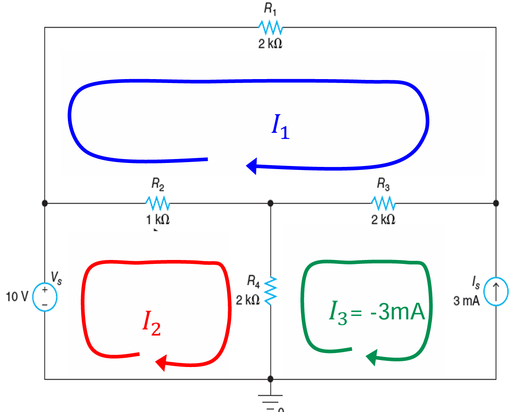
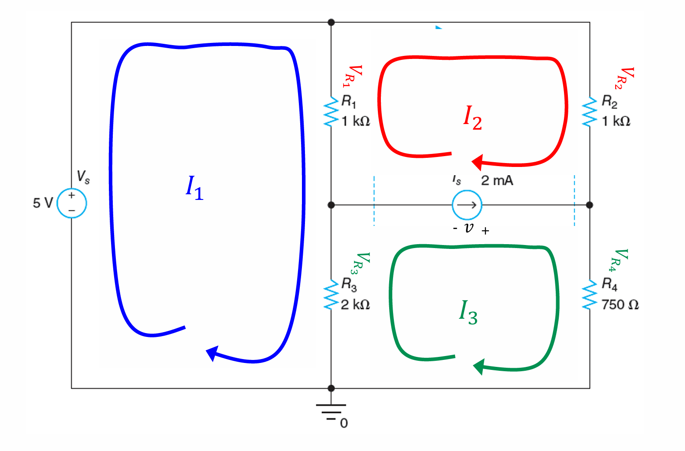

# Lecture 6 : Mesh Analysis & Supermesh

## Mesh Analysis（网孔分析法）

网孔(Mesh)是电路中的一个概念，它是一个闭合的路径，且不包含其他路径。在电路中，我们可以通过网孔分析法来求解电路中的电流。通过这个方法，我们可以把一个电路分解成若干个相互独立的网孔，并通过网孔分析法获得每个网孔中的网孔电流，进而获得通过电路中每个支路的电流。

网孔电流指的是在网孔中的电流，它是一个**环路电流**，是一个标量。在网孔分析法中，我们通常**假设**电流的方向是顺时针方向，这样我们就可以通过电压和电阻的关系来建立方程。

网孔分析法的基础是KVL（Kirchhoff's Voltage Law，基尔霍夫电压定律），即电路中任意一个闭合回路的电压和为0。我们把**压降的方向视为正方向**，那么对于一个网孔，我们可以通过电压和电阻的关系来建立方程。

网孔分析法的步骤：

- 找出电路中所有相互独立的网孔
- 把每个网孔中的电流设为未知数，分别标记为 $I_1, I_2, \dots, I_n$
- 对每个网孔列写KVL方程
- 解方程，求解每个网孔中的电流，进而得到每条支路中的电流

举个例子，对于这样的电路：

我们可以在这个电路中找到三个独立的网孔，分别假设网孔电流为 $I_1, I_2, I_3$，那么我们可以列写方程：

$$
\begin{cases}
I_1 \cdot R_1 + (I_1 - I_2) \cdot R_2 + (I_1 - I_3) \cdot R_3 = 0   \\
(I_2 - I_1) \cdot R_2 +  (I_2 - I_3) \cdot R_4 - V_s = 0   \\
I_3 = I_s
\end{cases}
$$

列写方程的过程中有一些细节可以注意：

1. 每个KVL方程以压降为正方向，这意味着如果有电压源，如果电压源方向与电流方向一致，那它压降为负；而如果电压源方向与电流方向相反，那它压降为正。
2. 对于每个电阻，它的压降是通过它的电流大小与阻值的积。而通过它的电流的大小是多个网孔电流的和。以当前网孔电流电流方向为正方向，如果其他网孔电流方向与当前网孔电流方向一致，那么它们的电流是相加的；如果其他网孔电流方向与当前网孔电流方向相反，那么它们的电流是相减的。
3. 一些情况下，可以直接通过网孔中的电流源确定网孔电流大小

## Supermesh（超网孔）

如果一个电路中有独立的电流源，我们就可以通过超网孔的方法来求解。超网孔的意思是把两个网孔之间的电流源当作一个整体，从而建立一个方程。

说得更简单易懂一些，就是两个电流 $i_1, i_2$ 之间有一个电流源，我们就可以把这两个网孔合并成一个超网孔，从而建立一个方程，同时添加一个方程得出 $i_1, i_2$ 的关系。

类似的，我们来看这个电路：

通过电流源支路，我们可以得到这样的一条方程：

$$
I_3 - I_2 = I_s
$$

同样的，写出它的方程：

$$
\begin{cases}
    (I_1-I_2)R_1 + (I_1-I_3)R_3 - V_s = 0 \\
    (I_2-I_1)R_1 + I_2R_2 + I_3R_4 + (I_3-I_1)R_3 = 0 \\
    I_3 - I_2 = I_s \\
\end{cases}
$$

和超节点类似，我们合成了两个网孔组成了一个更大的网孔，来消掉我们不知道的电流源两端的压降。所以这个方程叫做**超网孔方程**。
